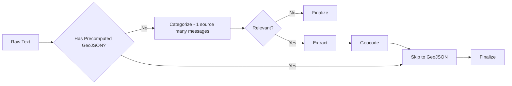

# Agent Development Guidelines

This document outlines critical patterns, standards, and workflows for AI agents working on the `oboapp`'s codebase. **Strict adherence is required.**

## 1. Core Principles & Workflow

### DRY & Shared Utilities

**Strictly enforce DRY (Don't Repeat Yourself).**

- **Check before implementing:** Always search `web/lib/` and `ingest/lib/` for existing utilities.
- **Extract duplicates:** If code is used in ≥2 files, extract it.
  - **Module scope:** Used in ≥2 files in one module → `module/utils.ts`
  - **Global scope:** Used in ≥2 modules → `ingest/lib/` or `web/lib/`
- **Naming:** Use named exports.

### Developer Preference Enforcement

If you identify a recurring pattern or developer preference:

1. **Apply immediate fix.**
2. **Suggest automation** (ESLint, Prettier, etc.).
3. **Propose AGENTS.md update** if it's a general project standard (affects 10+ files or architecture).

### Required Implementation Steps

**Every implementation plan must end with:**

1. **DRY Extraction:** Identify and extract duplicate patterns.
2. **Unit Tests:** Write Vitest tests for all functional units (parsers, transformers).
3. **Validation:** Run `npm run test:run` and fix failures.
4. **Documentation:** Update `README.md` and `AGENTS.md` as needed.

---

## 2. Technical Standards

### Firebase Admin & Environment Variables

**CRITICAL:** `dotenv` must load _before_ Firebase Admin initializes.

- **Rule:** Always use **dynamic imports** for `@/lib/firebase-admin` inside your main function.
- **Pattern:**

  ```typescript
  import dotenv from "dotenv";
  import { resolve } from "node:path";

  dotenv.config({ path: resolve(process.cwd(), ".env.local") });

  async function main() {
    const { adminDb } = await import("@/lib/firebase-admin"); // Dynamic import
    // ...
  }
  ```

### GeoJSON

- **Types:** Use `GeoJSONFeatureCollection` from `@/lib/types` (NOT `geojson` npm package).
- **Coordinates:** **[longitude, latitude]** order.
- **Validation:** Always use `validateAndFixGeoJSON` from `ingest/crawlers/shared/geojson-validation.ts`.
  - Handles coordinate swapping (lat/lng fix).
  - Wraps raw arrays in `FeatureCollection`.
- **Pattern:**
  ```typescript
  const validation = validateAndFixGeoJSON(rawJson, "source-name");
  if (!validation.isValid) return; // Log errors
  const cleanGeoJson = validation.geoJson;
  ```

### TypeScript

- **Strict Mode:** No implicit `any`.
- **Imports:** Prefer named exports.
- **No Barrel Files:** Avoid `index.ts` files that re-export other modules. Use direct imports instead (e.g., `import Button from "@/components/Button"` not `import { Button } from "@/components"`).

### ESLint & Code Quality

**Linting is configured for both `web/` and `ingest/` directories.**

- Run linting with `npm run lint` in the respective directory
- Auto-fix issues with `npm run lint:fix`
- **CRITICAL: NEVER use `eslint-disable` comments.**
- ESLint rules exist for good reasons (performance, bugs, maintainability)
- `eslint-disable` masks problems instead of fixing them
- Always fix the underlying issue, never suppress the warning
- If a rule seems wrong for the entire project, configure it in `eslint.config.mjs`
- **Exception:** Only disable rules in generated code or vendor files you cannot modify
- Test files, mocks, and utility scripts allow `any` types for flexibility

### Tailwind Theme System

**Always use theme colors from `lib/colors.ts` - never hardcode colors.**

**Architecture:**

- **Single source of truth:** `web/lib/colors.ts` - All color definitions
- **CSS variables:** `web/app/globals.css` - Theme implementation via Tailwind v4 @theme
- **Component utilities:** `web/lib/theme.ts` - Button styles and helpers

**Color Categories:**

- `primary` / `primary-hover` - Primary actions (blue, #1976D2)
- `destructive` / `destructive-hover` - Destructive actions (red, #E74C3C)
- `neutral` / `neutral-*` - Borders, backgrounds, text, disabled states (gray equivalents)
- `error` / `error-*` - Validation errors, error messages (red)
- `warning` / `warning-*` - Warnings, caution states (amber/yellow)
- `success` / `success-*` - Success states, confirmations (green)
- `info` / `info-*` - Informational messages (blue)
- `header-bg` / `nav-bg` / `footer-bg` / `link` - Layout-specific colors

**Button Styling:**

- Use `getButtonClasses(variant, size, radius)` from `lib/theme.ts`
- Available variants: `primary`, `destructive`, `secondary`, `warning`, `success`, `ghost`, `link`, `linkDestructive`
- Available sizes: `sm`, `md`, `lg`
- Available radius: `sm` (rounded-md, most common), `md` (rounded-lg), `lg` (rounded-xl), `full` (rounded-full)

**Pattern Examples:**

```typescript
// ✅ Good - Using theme colors
import { buttonStyles, buttonSizes, borderRadius } from "@/lib/theme";

<button className={`${buttonSizes.md} ${buttonStyles.primary} ${borderRadius.md}`}>
  Save
</button>

<div className="border border-neutral-border bg-neutral-light">
  Content
</div>

<div className="border border-error-border bg-error-light text-error">
  Error message
</div>

// ❌ Bad - Hardcoded colors
<button className="bg-blue-500 hover:bg-blue-600 px-4 py-2 rounded-lg">
  Save
</button>

<div className="border border-gray-200 bg-gray-50">
  Content
</div>

<div className="border border-red-200 bg-red-50 text-red-700">
  Error message
</div>
```

**Opacity & Border Radius:**

- Import from `lib/colors.ts`: `opacity`, `borderRadius`
- Use for consistent spacing and transparency across the app

### Adding dependencies

When adding npm dependencies always prefer running `npm install` over directly editing `package.json`.

---

## 3. Domain Guidelines

### Message Ingestion Pipeline

The pipeline processes messages about public infrastructure disruptions in Sofia, Bulgaria.

**Two-Stage LLM Processing:**

1. **Categorization Stage** (`ingest/lib/ai-service.ts` + `ingest/prompts/categorize.md`)
   - Single AI call processes entire message
   - Determines if message contains public infrastructure information
   - Returns array of categorized messages with rich metadata
   - Each message includes: categories, geographic scope, addresses, coordinates
   - Irrelevant messages are finalized immediately without geocoding

2. **Extraction Stage** (`ingest/prompts/data-extraction-overpass.md`)
   - Processes normalized text from filtering stage
   - Extracts pins (point locations), streets (sections), timespans
   - Generates markdown-formatted text for display
   - Returns structured `ExtractedData` object

**Pipeline Flow:**



**Crawler Integration:**

- Crawlers with `precomputedGeoJson` (sofiyska-voda, toplo-bg, erm-zapad, nimh-severe-weather) **skip categorization**
- Crawlers without GeoJSON (rayon-oborishte-bg, sofia-bg, mladost-bg, studentski-bg, sredec-sofia-org, so-slatina-org, lozenets-sofia-bg) **go through categorization**
- Markdown text from crawlers is stored directly via `options.markdownText`

**Field Storage:**

- `text` - Original user/crawler input
- `categorize` - Rich categorization result if categorization was performed
- `sourceDocumentId` - Links back to source document
- `extractedData` - Structured data (pins, streets, cadastral properties with timespans)
- `markdownText` - Denormalized from extractedData.markdown_text or crawler option
- `timespanStart` - Denormalized MIN start time (enables Firestore queries)
- `timespanEnd` - Denormalized MAX end time (enables Firestore queries)
- `geoJson` - Final geometry (determines public visibility)
- `finalizedAt` - Marks processing complete

**Database Indexes:**

- `categories` (array-contains) + `timespanEnd` (descending) - Category + time filtering
- `timespanEnd` (descending) - Uncategorized time filtering
- `categories` (array-contains) + `finalizedAt` (descending) - Legacy category filtering
- Deploy via `firebase deploy --only firestore:indexes` before code changes

### Crawler Development

- **Stable IDs:** Generate document IDs from stable data (e.g., CMS ID), not transient URLs.
- **GeoJSON:** Parse and validate geometry immediately.
- **Timespans:** Extract timespans in crawlers and store at source root as `timespanStart/End`.
- **Scripts:** Use the standard template (shebang, dotenv, dynamic imports). Run via `npm run tsx tmp/script.ts`.
- **Precomputed GeoJSON:** If crawler provides GeoJSON, it bypasses message categorization and extraction stages. Timespans transfer from source to message during ingestion.
- **City-Wide Messages:** Set `cityWide: true` with empty FeatureCollection for alerts applying to entire city. Bypasses viewport filtering (always visible), uses sofia.geojson for notification matching.
- **Workflow Sync (CRITICAL):** When adding/removing crawlers, update BOTH locations:
  1. `ingest/crawlers/{source-name}/` - Crawler implementation
  2. `ingest/terraform/workflows/all.yaml` - Add crawler to parallel execution step
  3. If emergent crawler (short-lived, 30-min intervals): Also update `ingest/terraform/workflows/emergent.yaml` and `EMERGENT_CRAWLERS` in `ingest/pipeline.ts`
  4. `ingest/pipeline.ts` syncs automatically (discovers crawlers from filesystem)
- **Emergent Classification:** Emergent crawlers (erm-zapad, toplo-bg, sofiyska-voda) run every 30 minutes. All others run 3x daily. This classification affects workflow definitions and Cloud Scheduler.

### Geocoding Services

**Hybrid Approach**: Google for pins, Overpass for streets, Cadastre for УПИ.

**Rate Limiting (CRITICAL):**

| Service  | Delay  | Reason                                      |
| -------- | ------ | ------------------------------------------- |
| Google   | 200ms  | API pricing/quota                           |
| Overpass | 500ms  | Fair use (free OSM)                         |
| Cadastre | 2000ms | Session management + respect government API |

**Routing**: `geocoding-router.ts` dispatches by location type:

- `geocodeAddresses()` → Google (pins with numbers)
- `geocodeIntersectionsForStreets()` → Overpass (street ∩ street)
- `geocodeCadastralPropertiesFromIdentifiers()` → Cadastre (УПИ)

**Validation**: All services check `isWithinSofia()` boundary.

**Documentation**: See `docs/features/geocoding-*.md` for service-specific details.

### Documentation Guidelines

**Target Audience**: QA personnel, system administrators, technical stakeholders - NOT developers (they read code).

**Keep Docs Concise**:

- Focus on behavior and operational knowledge
- Omit implementation details (algorithms, code patterns, TypeScript interfaces)
- Document "what happens" and "why", not "how it works"

**Avoid Duplication**:

- **NEVER duplicate big chunks of documentation** across multiple files
- **ALWAYS link to related content** instead of repeating text
- **ALWAYS aim for short, readable documentation** (prefer 50-100 lines over 200+)
- Link to existing sections rather than copy/paste content
- Example: Reference `docs/features/geocoding-overview.md` rather than duplicating service descriptions
- Maintain single source of truth for each topic

**When to Document**:

- New features affecting QA testing or system operations
- Configuration changes (environment variables, constants)
- Edge cases and error conditions
- External API integrations
- Pipeline architecture changes

### Web Components

- **Composition:** Break large components into smaller, focused files (e.g., `SettingsPage.tsx` → `NotificationsSection.tsx`).
- **Location:** Colocate components with their page if specific; move to `web/components/` if shared.
- **Props:** Use `readonly` interfaces.
- **No render functions:** Prefer extracting JSX into separate components instead of `render...()` functions inside components. Components are more idiomatic React and easier to test/reuse.

---

## 4. Troubleshooting

- **"FIREBASE_SERVICE_ACCOUNT_KEY not found":** You used a static import for firebase-admin. Switch to dynamic.
- **"Invalid GeoJSON":** Check coordinate order or missing `type`. Use `validateAndFixGeoJSON`.
- **Duplicate Records:** Ensure your document ID generation is deterministic and stable.
