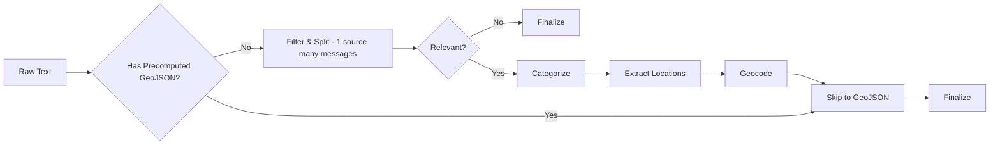

# Agent Development Guidelines

This document outlines critical patterns, standards, and workflows for AI agents working on the `oboapp`'s codebase. **Strict adherence is required.**

## 1. Core Principles & Workflow

### DRY & Shared Utilities

**Strictly enforce DRY (Don't Repeat Yourself).**

- **Check before implementing:** Always search `web/lib/` and `ingest/lib/` for existing utilities.
- **Extract duplicates:** If code is used in ≥2 files, extract it.
  - **Module scope:** Used in ≥2 files in one module → `module/utils.ts`
  - **Global scope:** Used in ≥2 modules → `ingest/lib/` or `web/lib/`
- **Naming:** Use named exports.

### Developer Preference Enforcement

If you identify a recurring pattern or developer preference:

1. **Apply immediate fix.**
2. **Suggest automation** (ESLint, Prettier, etc.).
3. **Propose AGENTS.md update** if it's a general project standard (affects 10+ files or architecture).

### Required Implementation Steps

**Every implementation plan must end with:**

1. **DRY Extraction:** Identify and extract duplicate patterns.
2. **Unit Tests:** Write Vitest tests for all functional units (parsers, transformers). For AI pipeline changes, update integration tests in `ingest/lib/ai-pipeline.integration.test.ts`.
3. **Validation:** Run `pnpm test:run` and fix failures. For AI changes, also run `pnpm test:integration` if API credentials are configured.
4. **Documentation:** Update `README.md` and `AGENTS.md` as needed.

### Pre-PR Quality Checks

**Before submitting any pull request, ensure ALL of the following pass:**

1. **Linting:** Run `pnpm lint` in both `ingest/` and `web/` directories - must pass with 0 errors
2. **TypeScript:** Run `pnpm tsc --noEmit` in both directories - must pass with 0 errors
3. **Tests:** Run `pnpm test:run` - all tests must pass
4. **Build:** Run `pnpm build` in `shared/` - must build successfully
5. **Code Review:** Use the `code_review` tool before finalizing

**CRITICAL:** Do NOT submit PRs with failing lints, TypeScript errors, or test failures.

---

## 2. Technical Standards

### Firebase Admin & Environment Variables

**CRITICAL:** `dotenv` must load _before_ Firebase Admin initializes.

- **Rule:** Always use **dynamic imports** for `@/lib/firebase-admin` inside your main function.
- **Pattern:**

  ```typescript
  import dotenv from "dotenv";
  import { resolve } from "node:path";

  dotenv.config({ path: resolve(process.cwd(), ".env.local") });

  async function main() {
    const { adminDb } = await import("@/lib/firebase-admin"); // Dynamic import
    // ...
  }
  ```

### Database Access (`@oboapp/db`)

**All database operations MUST go through `@oboapp/db` — never use `adminDb.collection()` directly.**

The `@oboapp/db` package provides a unified interface (`OboDb`) over Firestore and MongoDB via typed collection repositories. It handles serialization (JSON strings, Timestamps) transparently.

- **Initialization:** Use `getDb()` from `@/lib/db` (both `ingest/` and `web/`). It's a lazy singleton.
- **Collections:** `db.messages`, `db.sources`, `db.interests`, `db.notificationMatches`, `db.notificationSubscriptions`, `db.gtfsStops`
- **Key methods:** `findById(id)`, `findMany(options)`, `insertOne(data)`, `updateOne(id, data)`, `deleteOne(id)`, `count(where)`
- **Records:** All find methods return `Record<string, unknown>` with an `_id` field for the document ID.
- **Dates:** The adapter converts Firestore Timestamps → `Date` objects. Consumers convert to ISO strings as needed.
- **Serialization:** `geoJson` and `addresses` are automatically parsed from JSON strings (Firestore) — consumers receive native objects.

**Pattern:**

```typescript
import { getDb } from "@/lib/db";

async function example() {
  const db = await getDb();
  const message = await db.messages.findById("abc123");
  const docs = await db.messages.findMany({
    where: [{ field: "source", op: "==", value: "sofia-bg" }],
    orderBy: [{ field: "createdAt", direction: "desc" }],
    limit: 10,
  });
}
```

**Env vars (optional, for dual-write):** `MONGODB_URI`, `MONGODB_DATABASE`, `DB_READ_SOURCE` (firestore|mongodb)

### GeoJSON

- **Types:** Use `GeoJSONFeatureCollection` from `@/lib/types` (NOT `geojson` npm package).
- **Coordinates:** **[longitude, latitude]** order.
- **Validation:** Always use `validateAndFixGeoJSON` from `ingest/crawlers/shared/geojson-validation.ts`.
  - Handles coordinate swapping (lat/lng fix).
  - Wraps raw arrays in `FeatureCollection`.
- **Pattern:**
  ```typescript
  const validation = validateAndFixGeoJSON(rawJson, "source-name");
  if (!validation.isValid) return; // Log errors
  const cleanGeoJson = validation.geoJson;
  ```

### TypeScript

- **Strict Mode:** No implicit `any`.
- **Imports:** Prefer named exports.
- **No Barrel Files:** Avoid `index.ts` files that re-export other modules. Use direct imports instead (e.g., `import Button from "@/components/Button"` not `import { Button } from "@/components"`).

### ESLint & Code Quality

**Linting is configured for both `web/` and `ingest/` directories.**

- Run linting with `pnpm lint` in the respective directory
- Auto-fix issues with `pnpm lint:fix`
- **CRITICAL: NEVER use `eslint-disable` comments.**
- ESLint rules exist for good reasons (performance, bugs, maintainability)
- `eslint-disable` masks problems instead of fixing them
- Always fix the underlying issue, never suppress the warning
- If a rule seems wrong for the entire project, configure it in `eslint.config.mjs`
- **Exception:** Only disable rules in generated code or vendor files you cannot modify
- Test files, mocks, and utility scripts allow `any` types for flexibility

### Tailwind Theme System

**Always use theme colors from `lib/colors.ts` - never hardcode colors.**

**Architecture:**

- **Single source of truth:** `web/lib/colors.ts` - All color definitions
- **CSS variables:** `web/app/globals.css` - Theme implementation via Tailwind v4 @theme
- **Component utilities:** `web/lib/theme.ts` - Button styles and helpers

**Color Categories:**

- `primary` / `primary-hover` - Primary actions (blue, #1976D2)
- `destructive` / `destructive-hover` - Destructive actions (red, #E74C3C)
- `neutral` / `neutral-*` - Borders, backgrounds, text, disabled states (gray equivalents)
- `error` / `error-*` - Validation errors, error messages (red)
- `warning` / `warning-*` - Warnings, caution states (amber/yellow)
- `success` / `success-*` - Success states, confirmations (green)
- `info` / `info-*` - Informational messages (blue)
- `header-bg` / `nav-bg` / `footer-bg` / `link` - Layout-specific colors

**Button Styling:**

- Use `getButtonClasses(variant, size, radius)` from `lib/theme.ts`
- Available variants: `primary`, `destructive`, `secondary`, `warning`, `success`, `ghost`, `link`, `linkDestructive`
- Available sizes: `sm`, `md`, `lg`
- Available radius: `sm` (rounded-md, most common), `md` (rounded-lg), `lg` (rounded-xl), `full` (rounded-full)

**Pattern Examples:**

```typescript
// ✅ Good - Using theme colors
import { buttonStyles, buttonSizes, borderRadius } from "@/lib/theme";

<button className={`${buttonSizes.md} ${buttonStyles.primary} ${borderRadius.md}`}>
  Save
</button>

<div className="border border-neutral-border bg-neutral-light">
  Content
</div>

<div className="border border-error-border bg-error-light text-error">
  Error message
</div>

// ❌ Bad - Hardcoded colors
<button className="bg-blue-500 hover:bg-blue-600 px-4 py-2 rounded-lg">
  Save
</button>

<div className="border border-gray-200 bg-gray-50">
  Content
</div>

<div className="border border-red-200 bg-red-50 text-red-700">
  Error message
</div>
```

**Opacity & Border Radius:**

- Import from `lib/colors.ts`: `opacity`, `borderRadius`
- Use for consistent spacing and transparency across the app

### Adding dependencies

When adding dependencies always prefer running `pnpm add` (or `pnpm add -D` for dev) over directly editing `package.json`.

---

## 3. Domain Guidelines

### Message Ingestion Pipeline

The pipeline processes messages about public infrastructure disruptions in Sofia, Bulgaria.

**Three-Stage LLM Processing:**

1. **Filter & Split** (`filterAndSplit()` in `ingest/lib/ai-service.ts` + `ingest/prompts/filter-split.md`)
   - Splits a source notification into individual messages
   - Assesses relevance, normalizes text, extracts responsibleEntity and markdownText
   - Schema: array of `{ plainText, isRelevant, responsibleEntity, markdownText }`
   - Irrelevant messages are finalized immediately without further processing

2. **Categorize** (`categorize()` in `ingest/lib/ai-service.ts` + `ingest/prompts/categorize.md`)
   - Pure classification only (no splitting, no location extraction)
   - Schema: `{ categories }`

3. **Extract Locations** (`extractLocations()` in `ingest/lib/ai-service.ts` + `ingest/prompts/extract-locations.md`)
   - Extracts all location data: pins, streets, cadastralProperties, busStops, cityWide, withSpecificAddress
   - Replaces the old `extractStructuredData()` function entirely

**Pipeline Flow:**



**Crawler Integration:**

- Crawlers with `precomputedGeoJson` (sofiyska-voda, toplo-bg, erm-zapad, nimh-severe-weather) **skip all AI processing**
- Crawlers without GeoJSON (rayon-oborishte-bg, sofia-bg, mladost-bg, studentski-bg, sredec-sofia-org, so-slatina-org, lozenets-sofia-bg) **go through the 3-step AI pipeline** (Filter & Split, Categorize, Extract Locations)
- Markdown text from crawlers is stored directly via `options.markdownText`

**Field Storage:**

- `text` - Original user/crawler input
- `sourceDocumentId` - Links back to source document
- `plainText` - Normalized text from Filter & Split stage
- `markdownText` - Markdown-formatted text from Filter & Split or crawler option
- `categories` - Array of category strings from Categorize stage
- `pins`, `streets`, `cadastralProperties`, `busStops`, `cityWide` - Location fields denormalized at root level from Extract Locations stage
- `process` - Array of debug/audit trail entries tracking each pipeline step
- `timespanStart` - Denormalized MIN start time (enables Firestore queries)
- `timespanEnd` - Denormalized MAX end time (enables Firestore queries)
- `geoJson` - Final geometry (determines public visibility)
- `finalizedAt` - Marks processing complete

**Database Indexes:**

- `categories` (array-contains) + `timespanEnd` (descending) - Category + time filtering
- `timespanEnd` (descending) - Uncategorized time filtering
- `categories` (array-contains) + `finalizedAt` (descending) - Legacy category filtering
- Deploy via `firebase deploy --only firestore:indexes` before code changes

### Crawler Development

- **Stable IDs:** Generate document IDs from stable data (e.g., CMS ID), not transient URLs.
- **GeoJSON:** Parse and validate geometry immediately.
- **Timespans:** Extract timespans in crawlers and store at source root as `timespanStart/End`.
- **Scripts:** Use the standard template (shebang, dotenv, dynamic imports). Run via `pnpm tsx tmp/script.ts`.
- **Precomputed GeoJSON:** If crawler provides GeoJSON, it bypasses all AI processing stages (Filter & Split, Categorize, Extract Locations). Timespans transfer from source to message during ingestion.
- **City-Wide Messages:** Set `cityWide: true` with empty FeatureCollection for alerts applying to entire city. Bypasses viewport filtering (always visible), uses sofia.geojson for notification matching.
- **Workflow Sync (CRITICAL):** When adding/removing crawlers, update BOTH locations:
  1. `ingest/crawlers/{source-name}/` - Crawler implementation
  2. `ingest/terraform/workflows/all.yaml` - Add crawler to parallel execution step
  3. If emergent crawler (short-lived, 30-min intervals): Also update `ingest/terraform/workflows/emergent.yaml` and `EMERGENT_CRAWLERS` in `ingest/pipeline.ts`
  4. `ingest/pipeline.ts` syncs automatically (discovers crawlers from filesystem)
- **Emergent Classification:** Emergent crawlers (erm-zapad, toplo-bg, sofiyska-voda) run every 30 minutes. All others run 3x daily. This classification affects workflow definitions and Cloud Scheduler.

### Geocoding Services

**Hybrid Approach**: Google for pins, Overpass for streets, Cadastre for УПИ.

**Rate Limiting (CRITICAL):**

| Service  | Delay  | Reason                                      |
| -------- | ------ | ------------------------------------------- |
| Google   | 200ms  | API pricing/quota                           |
| Overpass | 500ms  | Fair use (free OSM)                         |
| Cadastre | 2000ms | Session management + respect government API |

**Routing**: `geocoding-router.ts` dispatches by location type:

- `geocodeAddresses()` → Google (pins with numbers); skips geocoding for pre-resolved coordinates from AI
- `geocodeIntersectionsForStreets()` → Overpass (street ∩ street)
- `geocodeCadastralPropertiesFromIdentifiers()` → Cadastre (УПИ)
- Bus stops → resolved from ExtractedLocations data

**Validation**: All services check `isWithinSofia()` boundary.

**Documentation**: See `docs/features/geocoding-*.md` for service-specific details.

### Documentation Guidelines

**Target Audience**: QA personnel, system administrators, technical stakeholders - NOT developers (they read code).

**Keep Docs Concise**:

- Focus on behavior and operational knowledge
- Omit implementation details (algorithms, code patterns, TypeScript interfaces)
- Document "what happens" and "why", not "how it works"

**Avoid Duplication**:

- **NEVER duplicate big chunks of documentation** across multiple files
- **ALWAYS link to related content** instead of repeating text
- **ALWAYS aim for short, readable documentation** (prefer 50-100 lines over 200+)
- Link to existing sections rather than copy/paste content
- Example: Reference `docs/features/geocoding-overview.md` rather than duplicating service descriptions
- Maintain single source of truth for each topic

**When to Document**:

- New features affecting QA testing or system operations
- Configuration changes (environment variables, constants)
- Edge cases and error conditions
- External API integrations
- Pipeline architecture changes

### Web Components

- **Composition:** Break large components into smaller, focused files (e.g., `SettingsPage.tsx` → `NotificationsSection.tsx`).
- **Location:** Colocate components with their page if specific; move to `web/components/` if shared.
- **Props:** Use `readonly` interfaces.
- **No render functions:** Prefer extracting JSX into separate components instead of `render...()` functions inside components. Components are more idiomatic React and easier to test/reuse.

### Public API Surface

- Public read-only API endpoints are exposed under `/api/v1`.
- External clients must consume the same `/api/v1` contract with API keys.
- Keep `docs/features/public-api.md` as the single source of truth for public API behavior.

### Mock Service Worker (MSW) for Front-End Development

**Purpose**: Enable front-end developers to work without Firebase emulators (no Java/Docker required).

**Architecture**:

- **Fixtures**: Static mock data in `web/__mocks__/fixtures/` (~20 messages, 2 interests, 5 notifications)
- **Handlers**: MSW request handlers in `web/__mocks__/handlers.ts` intercept all `/api/*` routes
- **Browser worker**: `web/__mocks__/browser.ts` sets up service worker in development mode
- **Auth mock**: `web/__mocks__/firebase-auth.ts` provides pre-authenticated user state

**Activation**: Set `NEXT_PUBLIC_USE_MSW=true` in `.env.local` (see `web/.env.example` and `docs/setup/quick-start-frontend-msw.md`)

**Coverage**:

- ✅ All API routes mocked (messages, interests, subscriptions, notifications)
- ✅ Firebase Auth returns mock user (bypasses Google OAuth)
- ✅ In-memory CRUD state for interests/subscriptions
- ❌ No Firebase Cloud Messaging (push notifications)
- ❌ No real-time Firestore listeners

**When to update**:

- **New API routes**: Add handlers to `web/__mocks__/handlers.ts`
- **New schema fields**: Update fixtures to match schemas from `@oboapp/shared`
- **Edge cases**: Add test messages covering new categories or data structures

**Documentation**: See `docs/setup/quick-start-frontend-msw.md` for developer setup guide.

---

## 4. Troubleshooting

- **"FIREBASE_SERVICE_ACCOUNT_KEY not found":** You used a static import for firebase-admin. Switch to dynamic.
- **"Invalid GeoJSON":** Check coordinate order or missing `type`. Use `validateAndFixGeoJSON`.
- **Duplicate Records:** Ensure your document ID generation is deterministic and stable.
- **Tests fail in CI/CD but pass locally:** Shared package changes require rebuild. Run `pnpm build` in `shared/` directory or `pnpm install` at repository root (triggers postinstall hook). Common symptom: snapshot tests showing schema field mismatches.
