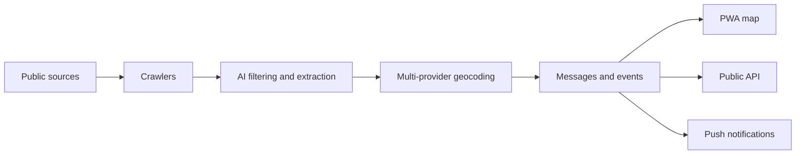

# OboApp

<p align="center">
	
</p>

<p align="center">
	<strong>Open-source civic infrastructure intelligence for cities.</strong>
</p>

<p align="center">
	<a href="LICENSE"></a>
	
	
	<a href="https://sonarcloud.io/summary/new_code?id=oboapp_oboapp">
		
	</a>
	<a href="https://sonarcloud.io/summary/new_code?id=oboapp_oboapp">
		
	</a>
</p>

OboApp helps residents stay informed about public infrastructure disruptions. It collects announcements about water shutoffs, heating maintenance, road repairs, municipal works, and similar incidents; turns them into structured geospatial events; and serves them through a PWA map, push notifications, and a public API.

Built for Sofia first, OboApp is designed so other cities can fork the platform, configure their own local sources, and operate an independent civic information service.

## What You Can Build With It

- A public map of active infrastructure disruptions
- Push notifications for user-defined areas
- A city-specific ingest pipeline for public notices
- A read-only public disruption API
- A local civic data platform backed by Firebase, MongoDB, and geospatial enrichment

## How It Works



Automated crawlers collect notices from public sources such as utility providers, heating companies, transport operators, and municipal sites. AI-powered filtering, categorization, location extraction, and multi-service geocoding convert raw text into map-ready GeoJSON. Event matching groups related disruptions, and the notification engine matches new events with user-defined interest areas.

The web app is a Next.js Progressive Web App with an interactive map. Users can browse current disruptions, define interest circles with a custom radius, and receive notifications when new issues affect their areas.

## Quick Start

Choose the setup path that matches what you want to work on:

| Goal                                         | Start here                                                                |
| -------------------------------------------- | ------------------------------------------------------------------------- |
| Front-end development without Java or Docker | [Quick Start: Front-End with MSW](docs/setup/quick-start-frontend-msw.md) |
| Full-stack local development with emulators  | [Quick Start: Firebase Emulators](docs/setup/quick-start-emulators.md)    |
| Production deployment                        | [Production Setup Guide](docs/setup/production-setup.md)                  |
| API integration                              | [Public API](docs/features/public-api.md)                                 |

This is a pnpm workspace monorepo. Always install dependencies from the repository root:

```bash
pnpm install
```

The shared packages build automatically during `postinstall`.

If you modify shared schemas or database types, rebuild before running `web/`, `ingest/`, or `api/` code:

```bash
pnpm build:shared
pnpm build:db
```

## Monorepo Packages

| Package           | Purpose                                                                                      |
| ----------------- | -------------------------------------------------------------------------------------------- |
| [shared/](shared) | Shared TypeScript schemas and source configuration used by the app, API, and ingest pipeline |
| [db/](db)         | Database abstraction layer, `@oboapp/db`, with dual-write support over Firestore and MongoDB |
| [ingest/](ingest) | Crawlers, AI processing, geocoding, event matching, and notifications                        |
| [web/](web)       | Next.js PWA, map UI, onboarding, notifications UX, and BFF route handlers                    |
| [api/](api)       | Public REST API built with Hono, Zod, OpenAPI generation, and API key auth                   |

## Tech Stack

| Area           | Stack                                                                                                      |
| -------------- | ---------------------------------------------------------------------------------------------------------- |
| Web app        | Next.js, React, TypeScript, Tailwind CSS, Google Maps API, Leaflet, TanStack React Query, MDX              |
| BFF            | Next.js Route Handlers, Firebase Auth                                                                      |
| Public API     | Hono on Vercel, Zod, OpenAPI auto-generation, API key auth                                                 |
| Pipeline       | Node.js, Playwright, Google Cloud Run Jobs, Cloud Workflows                                                |
| Database       | Firebase Auth, Firestore, Cloud Messaging, MongoDB, `@oboapp/db`                                           |
| AI             | Google Gemini for filtering, categorization, location extraction, and embeddings; promptfoo for evaluation |
| Geospatial     | Google Geocoding, OpenStreetMap Overpass, Bulgarian Cadastre, GTFS, Turf.js                                |
| Infrastructure | Google Cloud Run, Workflows, Scheduler, Storage, Terraform, Docker, Vercel                                 |
| Testing        | Vitest, Testing Library, MSW, Playwright                                                                   |
| Tooling        | pnpm workspaces, ESLint, esbuild, TypeScript strict mode                                                   |

## Contribution Areas

OboApp has several independent surfaces for contributors. Each area links to open issues where that kind of work is needed.

New contributors may want to start with [good first issues](https://github.com/oboapp/oboapp/issues?q=is%3Aissue%20state%3Aopen%20label%3A%22good%20first%20issue%22) or [help wanted issues](https://github.com/oboapp/oboapp/issues?q=is%3Aissue%20state%3Aopen%20label%3A%22help%20wanted%22).

| Area                   | What you can work on                                              | Open issues                                                                                                                                                                                                                                           |
| ---------------------- | ----------------------------------------------------------------- | ----------------------------------------------------------------------------------------------------------------------------------------------------------------------------------------------------------------------------------------------------- |
| Crawlers               | Add or improve public disruption sources                          | [crawler issues](https://github.com/oboapp/oboapp/issues?q=is%3Aissue%20state%3Aopen%20label%3Acrawler)                                                                                                                                               |
| Ingestion pipeline     | Filtering, extraction, source cleanup, and pipeline reliability   | [ingestion issues](https://github.com/oboapp/oboapp/issues?q=is%3Aissue%20state%3Aopen%20label%3Aingestion)                                                                                                                                           |
| Geocoding              | Address, street, locality, transit, and geometry resolution       | [geocoding issues](https://github.com/oboapp/oboapp/issues?q=is%3Aissue%20state%3Aopen%20label%3Ageocoding)                                                                                                                                           |
| Event aggregation      | Duplicate detection, event matching, and incident lifecycle       | [event aggregation issues](https://github.com/oboapp/oboapp/issues?q=is%3Aissue%20state%3Aopen%20label%3A%22event%20aggregations%22)                                                                                                                  |
| Notifications          | Matching events to user zones and delivering push notifications   | [notification issues](https://github.com/oboapp/oboapp/issues?q=is%3Aissue%20state%3Aopen%20label%3Anotifications)                                                                                                                                    |
| Web app                | Map UI, onboarding, installability, and interaction design        | [UI issues](https://github.com/oboapp/oboapp/issues?q=is%3Aissue%20state%3Aopen%20label%3AUI) and [UX issues](https://github.com/oboapp/oboapp/issues?q=is%3Aissue%20state%3Aopen%20label%3AUX)                                                       |
| Public API             | API contract, docs, client onboarding, and response shape         | [Public API issues](https://github.com/oboapp/oboapp/issues?q=is%3Aissue%20state%3Aopen%20label%3A%22Public%20API%22)                                                                                                                                 |
| Multi-locality support | Making OboApp easier to run for other cities                      | [multi-locality issues](https://github.com/oboapp/oboapp/issues?q=is%3Aissue%20state%3Aopen%20label%3Amulti-locality)                                                                                                                                 |
| Testing and tooling    | Test coverage, mocks, CI, scripts, and local development workflow | [testing issues](https://github.com/oboapp/oboapp/issues?q=is%3Aissue%20state%3Aopen%20label%3Atesting) and [developer experience issues](https://github.com/oboapp/oboapp/issues?q=is%3Aissue%20state%3Aopen%20label%3A%22developer%20experience%22) |

See [CONTRIBUTING.md](CONTRIBUTING.md) for the full contribution process.

## Quality Bar

Before opening a PR, run the checks that match the packages you changed. The broad workspace checks are:

```bash
pnpm build:all
pnpm lint:all
pnpm test:all
```

For TypeScript validation, run `pnpm tsc --noEmit` in the affected package, especially [ingest/](ingest), [web/](web), and [api/](api).

Important project rules:

- Database operations go through `@oboapp/db`; application code should not call Firestore directly.
- Shared schema changes require rebuilding [shared/](shared) and [db/](db) before running dependent packages.
- New crawlers should update the crawler implementation, Terraform crawler list, source definition, and source assembly together.
- Web UI text is Bulgarian in informal register.
- Documentation is concise, behavior-focused, and written for technical stakeholders, operators, and QA personnel.

Additional implementation standards live in [AGENTS.md](AGENTS.md).

## Documentation

### Features

- [Message Filtering](docs/features/message-filtering.md) - AI-powered content filtering, address extraction, geocoding, and time-based relevance
- [Message URLs](docs/features/message-urls.md) - Short, shareable URLs for deep-linking to messages
- [Geocoding System](ingest/geocoding/README.md) - Multi-service geocoding with Google, OpenStreetMap, Bulgarian Cadastre, and GTFS APIs
- [Onboarding Flow](docs/features/onboarding-flow.md) - User onboarding state machine for notifications and zone creation
- [Database Layer](docs/features/database-layer.md) - Dual-write database abstraction over Firestore and MongoDB
- [Locality Configuration](docs/features/multi-locality-support.md) - Environment-based locality configuration for hosting in different cities
- [Public API](docs/features/public-api.md) - Read-only `/api/v1` API, API key auth, and client onboarding

### Pipeline

- [Ingest Overview](ingest/README.md) - Data collection and processing pipeline architecture
- [Message Processing](ingest/messageIngest/README.md) - Filtering, extraction, geocoding, and GeoJSON conversion flow
- [Crawlers](ingest/crawlers/README.md) - Data sources and web scraping implementations

### Operations

- [Notifications](ingest/notifications/README.md) - Push notification matching and delivery
- [Terraform](ingest/terraform/README.md) - Cloud Run deployment and infrastructure
- [Web App](web/README.md) - PWA installation and browser support
