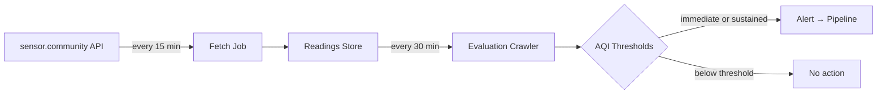

# Air Quality Monitoring

## Overview

The system monitors outdoor particulate matter (PM2.5 and PM10) using data from the [sensor.community](https://sensor.community/) citizen science network. Two separate jobs work together:

1. **Fetch job** — collects raw sensor readings every 15 minutes and stores them in a rolling 24-hour window.
2. **Evaluation crawler** — runs every 30 minutes during daytime hours, analyzes the stored readings, and generates alerts when air quality deteriorates.

Alerts flow into the standard message ingestion pipeline with the `air-quality` category and appear on the map as grid cell polygons.

## How It Works

### Fetch Job

Queries the sensor.community API for all outdoor sensors within the configured locality bounds. Each reading is validated (coordinate bounds, PM value sanity, indoor sensor exclusion) before storage. Duplicate readings are deduplicated by sensor ID and timestamp. Readings older than 24 hours are pruned automatically.

### Evaluation Crawler

Loads the last 4 hours of readings from the store and groups them into a grid of ~4 km cells. Within each cell:

1. **Outlier filtering** — a hard cap removes malfunctioning sensors, then IQR filtering removes statistical outliers per pollutant.
2. **Minimum sensor check** — cells with fewer than 3 unique sensors (after filtering) are skipped to avoid noisy single-sensor alerts.
3. **Hourly coverage check** — at least 50% of hourly time bins must have data.
4. **European AQI** — the NowCast algorithm computes a weighted average that gives more weight to recent hours, then maps PM concentrations to the European Air Quality Index (1–6 scale).
5. **Alert decision** — two alert types exist (see below).

## Alert Types

The 4-hour evaluation window is split into two non-overlapping halves: a **previous half** (t−4h to t−2h) and a **current half** (t−2h to now).

| Alert Type    | Condition                         | Meaning                                          |
| ------------- | --------------------------------- | ------------------------------------------------ |
| **Immediate** | Current half EAQI ≥ 5 (Very Poor) | Air quality is very poor right now               |
| **Sustained** | Both halves EAQI ≥ 4 (Poor)       | Air quality has been poor for an extended period |

Each alert is created as a source document with the grid cell's polygon geometry, the `air-quality` category, and a timespan covering the current evaluation half.

## AQI Scale

The system uses the [European Air Quality Index (EAQI)](https://airindex.eea.europa.eu/AQI/index.html) with Bulgarian labels:

| EAQI | Level                              | PM2.5 (μg/m³) | PM10 (μg/m³) |
| ---- | ---------------------------------- | ------------- | ------------ |
| 1    | Добро (Good)                       | 0–10          | 0–20         |
| 2    | Задоволително (Fair)               | 10–20         | 20–40        |
| 3    | Умерено (Moderate)                 | 20–25         | 40–50        |
| 4    | Лошо (Poor)                        | 25–50         | 50–100       |
| 5    | Много лошо (Very Poor)             | 50–75         | 100–150      |
| 6    | Изключително лошо (Extremely Poor) | >75           | >150         |

## Scheduling

| Job        | Schedule                              | Notes                                           |
| ---------- | ------------------------------------- | ----------------------------------------------- |
| Fetch      | `*/15 * * * *` (every 15 min, 24/7)   | Standalone Cloud Run job                        |
| Evaluation | Part of the emergent crawler workflow | Runs every 30 min, 7 AM–10:30 PM (Europe/Sofia) |

## Configuration

Both the ingest package (for the fetch job and crawler) and the web package (for the `/air-quality` monitoring page) read from environment variables. Key settings:

| Variable | Package | Required | Description |
|----------|---------|----------|-------------|
| `GCS_GENERIC_BUCKET` | ingest, web | Production | GCS bucket name for general-purpose file storage |
| `LOCAL_READINGS_PATH` | ingest, web | No | Local filesystem path for development (default: `./tmp/air-quality`) |
| `LOCALITY` | ingest | Yes | Locality identifier that determines the geographic bounds |
| `NEXT_PUBLIC_LOCALITY` | web | Yes | Locality shown on the `/air-quality` monitoring page and used as the default locality in `/api/air-quality/status` when no `locality` query parameter is provided |

See the `.env.example` files in each package for the full list of variables.

## Monitoring Page

The `/air-quality` page in the web app provides a real-time dashboard for the sensor.community pipeline. It displays:

- **Summary stats** — maximum EAQI, number of active sensors, and total message/notification counts.
- **Data freshness** — whether the most recent reading is fresh (within 45 minutes) or stale.
- **Grid cell map** — a Leaflet map with colour-coded ~4 km cells showing the current EAQI by area, computed from the last 4 hours of readings.
- **Recent alerts** — the latest messages produced by the crawler.

The page is currently only reachable by direct URL (`/air-quality`) — no link to it is published in the app navigation.

The page queries `/api/air-quality/status` every 60 seconds. The API reads the GCS readings file and computes NowCast AQI per grid cell. Results are cached for up to 5 minutes on a best-effort basis per running server instance, which helps reduce GCS reads but does not guarantee the same cache is shared across all requests (e.g. across serverless cold starts or multiple instances).

## Storage

See [Air Quality Storage](air-quality-storage.md) for details on how raw readings are persisted.
