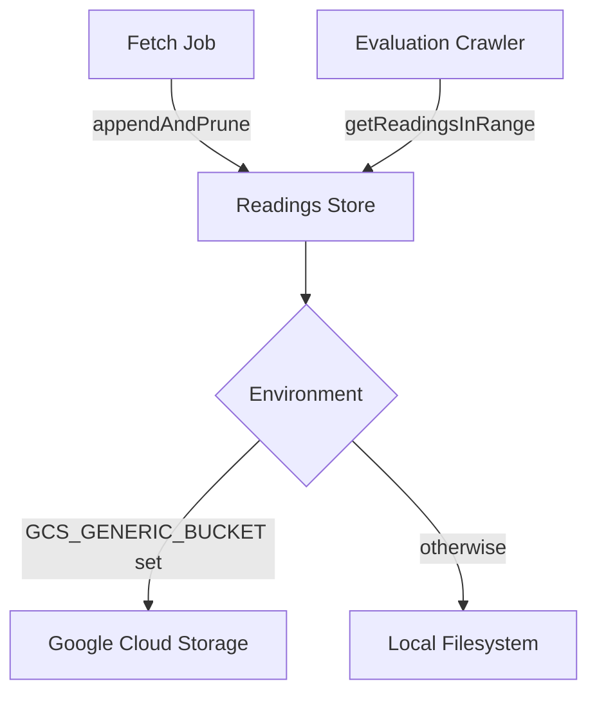

# Air Quality Storage

## Overview

Raw sensor readings are stored as JSON files — one file per locality — containing a rolling window of the last 24 hours. This approach replaces database storage to minimize write costs, since the data is high-churn (thousands of readings every 15 minutes) and only needed for short-term evaluation.

## Architecture

The store provides two operations:

- **Append and prune** — merges new readings into the existing file, deduplicates by sensor ID + timestamp, and removes readings older than the retention window (24 hours).
- **Get readings in range** — loads and filters readings by a time window, returning them with reconstituted timestamps.

## Production (GCS)

Readings are stored in a GCS bucket at `air-quality/{locality}/readings.json`. The bucket name is configured via the `GCS_GENERIC_BUCKET` environment variable. Each write overwrites the entire file with the updated rolling window.

## Development (Local Filesystem)

When `GCS_GENERIC_BUCKET` is not set, readings fall back to the local filesystem at `{LOCAL_READINGS_PATH}/{locality}/readings.json`. The default path is `./tmp/air-quality`. Directories are created automatically on first write.

This enables full local development without GCS emulators or cloud credentials.

## Data Retention

Readings older than 24 hours are pruned on every append cycle. The evaluation crawler only needs the last 4 hours, but the 24-hour window provides a safety margin for debugging and reprocessing.

## Related

- [Air Quality Monitoring](air-quality-monitoring.md) — feature overview, alert types, and scheduling
