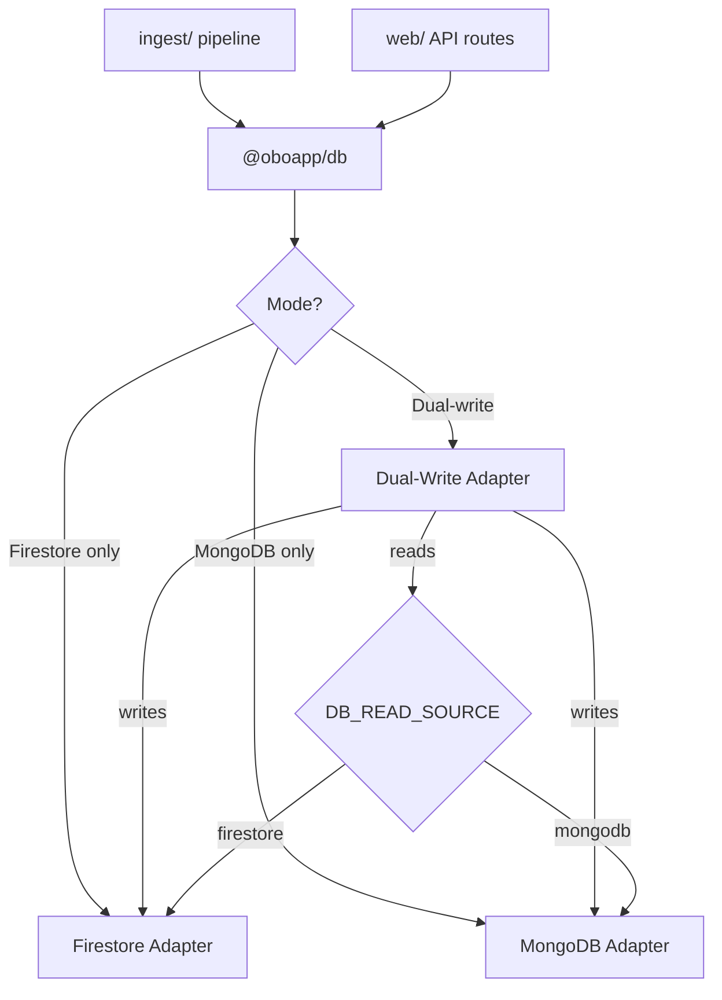

# Database Layer

## Overview

All database operations go through the `@oboapp/db` package, which abstracts Firestore and MongoDB behind a unified interface. The system supports dual-write mode: **writes go to both databases** while reads come from a configurable primary source. This enables a gradual migration from Firestore to MongoDB without downtime.

Firebase Auth and Cloud Messaging are unaffected — only the data layer is abstracted.

## Architecture



## Collections

| Collection                  | Purpose                                   | Key Indexes                            |
| --------------------------- | ----------------------------------------- | -------------------------------------- |
| `messages`                  | Infrastructure disruption announcements   | categories + timespanEnd, 2dsphere geo |
| `sources`                   | Raw crawled data before processing        | sourceType, crawledAt                  |
| `interests`                 | User-defined notification zones (circles) | userId + createdAt                     |
| `notificationSubscriptions` | FCM push tokens per user                  | userId + token (unique)                |
| `notificationMatches`       | Notification delivery log                 | notified + userId + notifiedAt         |
| `gtfsStops`                 | Bus stop locations (GTFS data)            | stopCode as `_id`                      |

## Operating Modes

### Firestore Only (default)

No MongoDB configuration needed. All reads and writes go to Firestore. This is the baseline behavior when `MONGODB_URI` is not set.

### Dual-Write

When both Firestore credentials and `MONGODB_URI` are configured, all writes go to both databases. Reads come from whichever backend `DB_READ_SOURCE` specifies.

- **Stage 1** (`DB_READ_SOURCE=firestore`): Reads from Firestore, writes to both. Use this while validating MongoDB data integrity.
- **Stage 2** (`DB_READ_SOURCE=mongodb`): Reads from MongoDB, writes to both. Firestore becomes a backup.

### MongoDB Only

When only `MONGODB_URI` is set (no Firestore credentials), all operations go to MongoDB.

## Configuration

| Variable           | Values                  | Default     | Description                |
| ------------------ | ----------------------- | ----------- | -------------------------- |
| `MONGODB_URI`      | Connection string       | —           | Enables MongoDB backend    |
| `MONGODB_DATABASE` | Database name           | `oboapp`    | MongoDB database to use    |
| `DB_READ_SOURCE`   | `firestore` / `mongodb` | `firestore` | Which backend serves reads |

## Type Mapping

The adapters handle type differences transparently:

| Firestore                      | MongoDB        |
| ------------------------------ | -------------- |
| `FieldValue.serverTimestamp()` | `new Date()`   |
| `FieldValue.arrayUnion()`      | `$addToSet`    |
| `Timestamp`                    | `Date`         |
| Stringified JSON (`geoJson`)   | Native objects |

## Local Development

MongoDB runs via Docker Compose:

```bash
docker compose up -d          # Start MongoDB + Mongo Express
```

- **MongoDB**: `localhost:27017` (user: `oboapp`, password: `oboapp_dev`)
- **Mongo Express** (admin UI): `localhost:8081`

## Migration Scripts

Located in `db/migrate/`. Run from the `db/` directory:

```bash
cd db && npx tsx migrate/<script-name>.ts
```

| Script                             | Purpose                                          |
| ---------------------------------- | ------------------------------------------------ |
| `2026-02-10-add-locality-field.ts` | Backfills locality field on sources and messages |
| `2026-02-13-firestore-to-mongo.ts` | One-time Firestore → MongoDB data migration      |

The Firestore-to-MongoDB migration is idempotent (uses upserts) and verifies document counts after completion.

## MongoDB Indexes

Defined in `db/src/indexes.ts`. Applied automatically via `ensureIndexes()` or manually:

```bash
cd db && npx tsx -e "import { ensureIndexes } from './src/indexes'; ensureIndexes(db)"
```

Notable MongoDB-specific indexes beyond Firestore equivalents:

- **2dsphere** on `geoJson.features.geometry` — enables native geospatial queries, replacing app-level viewport filtering
- **Unique compound** on `notificationSubscriptions.userId + token` — prevents duplicate FCM registrations
