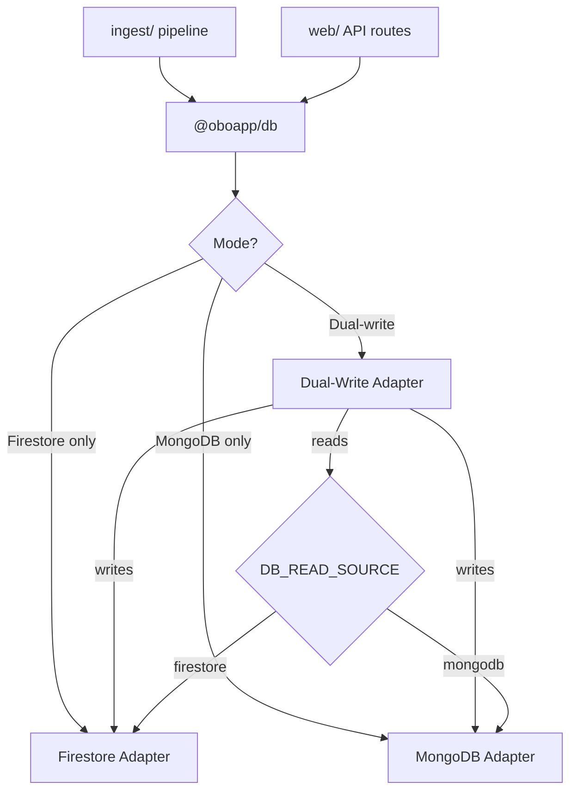

# Database Layer

## Overview

All database operations go through the `@oboapp/db` package, which abstracts Firestore and MongoDB behind a unified interface. The system supports dual-write mode: **writes go to both databases** while reads come from a configurable primary source. This enables a gradual migration from Firestore to MongoDB without downtime.

Firebase Auth and Cloud Messaging are unaffected — only the data layer is abstracted.

## Architecture


```mermaid
flowchart TD
    A[ingest/ pipeline] --> B["@oboapp/db"]
    C[web/ API routes] --> B
    B --> D{Mode?}
    D -->|Firestore only| E[Firestore Adapter]
    D -->|MongoDB only| F[MongoDB Adapter]
    D -->|Dual-write| G[Dual-Write Adapter]
    G -->|writes| E
    G -->|writes| F
    G -->|reads| H{DB_READ_SOURCE}
    H -->|firestore| E
    H -->|mongodb| F
```

## Collections

| Collection                  | Purpose                                   | Key Indexes                            |
| --------------------------- | ----------------------------------------- | -------------------------------------- |
| `messages`                  | Infrastructure disruption announcements   | categories + timespanEnd, 2dsphere geo |
| `sources`                   | Raw crawled data before processing        | sourceType, crawledAt                  |
| `interests`                 | User-defined notification zones (circles) | userId + createdAt                     |
| `notificationSubscriptions` | FCM push tokens per user                  | userId + token (unique)                |
| `notificationMatches`       | Notification delivery log                 | notified + userId + notifiedAt         |
| `gtfsStops`                 | Bus stop locations (GTFS data)            | stopCode as `_id`                      |
| `events`                    | Aggregated real-world incidents            | locality + timespanEnd, locality + categories + timespanEnd |
| `eventMessages`             | Links between messages and events         | eventId + createdAt, messageId         |

For event aggregation, `eventMessages` is the authoritative relationship table. `messages.eventId` is a denormalized cache field and may occasionally lag behind links during retries or concurrent processing.

## Operating Modes

### Firestore Only (default)

No MongoDB configuration needed. All reads and writes go to Firestore. This is the baseline behavior when `MONGODB_URI` is not set.

### Dual-Write

When both Firestore credentials and `MONGODB_URI` are configured, all writes go to both databases. Reads come from whichever backend `DB_READ_SOURCE` specifies.

- **Stage 1** (`DB_READ_SOURCE=firestore`): Reads from Firestore, writes to both. Use this while validating MongoDB data integrity.
- **Stage 2** (`DB_READ_SOURCE=mongodb`): Reads from MongoDB, writes to both. Firestore becomes a backup.

### MongoDB Only

When only `MONGODB_URI` is set (no Firestore credentials), all operations go to MongoDB.

## Configuration

| Variable           | Values                  | Default     | Description                |
| ------------------ | ----------------------- | ----------- | -------------------------- |
| `MONGODB_URI`      | Connection string       | —           | Enables MongoDB backend    |
| `MONGODB_DATABASE` | Database name           | `oboapp`    | MongoDB database to use    |
| `DB_READ_SOURCE`   | `firestore` / `mongodb` | `firestore` | Which backend serves reads |

## Type Mapping

The adapters handle type differences transparently:

| Firestore                      | MongoDB        |
| ------------------------------ | -------------- |
| `FieldValue.serverTimestamp()` | `new Date()`   |
| `FieldValue.arrayUnion()`      | `$addToSet`    |
| `Timestamp`                    | `Date`         |
| Stringified JSON (`geoJson`)   | Native objects |

For event aggregation records, `null` is used intentionally to represent "known missing" values (for example optional text/timespans/signals that were attempted but unavailable). `undefined` means the field was not set.

## Local Development

MongoDB runs via Docker Compose:

```bash
docker compose up -d          # Start MongoDB + Mongo Express + one-shot index provisioning
```

- **MongoDB**: `localhost:27017` (user: `oboapp`, password: `oboapp_dev`)
- **Mongo Express** (admin UI): `localhost:8081`
- **Indexes**: the `mongo-indexes` one-shot service waits for MongoDB to become healthy,
  then runs `pnpm indexes:ensure` from the DB package to apply index definitions.
  It attempts to create all indexes and reports failures at the end, and it is safe to re-run.

## Migration Scripts

Migration scripts are located in `db/migrate/`. They handle tasks such as backfilling fields, data migration between backends, and creating new collections from existing data. Migrations are designed to be idempotent (safe to re-run).

```bash
cd db && npx tsx migrate/<script-name>.ts
```

## MongoDB Indexes

Indexes are defined in the DB package and applied by the default Docker `mongo-indexes`
service. For non-Docker environments, run them manually:

```bash
cd db && MONGODB_URI=mongodb://localhost:27017 pnpm indexes:ensure
```

Notable MongoDB-specific indexes beyond Firestore equivalents:

- **2dsphere** on `geoJson.features.geometry` — enables native geospatial queries, replacing app-level viewport filtering
- **Unique compound** on `notificationSubscriptions.userId + token` — prevents duplicate FCM registrations
- **Locality-scoped message indexes** — support public consumers that filter by locality,
  active timespan, category/city-wide status, and incremental sync timestamps
