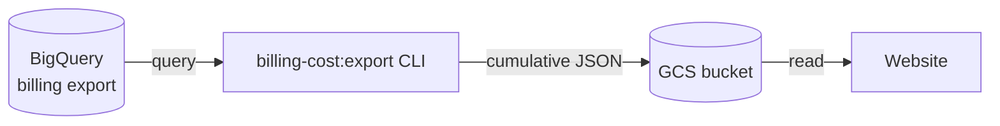

# GCP Billing Cost Report

## Overview

oboapp.online runs on Google Cloud Platform. This feature provides a public, operator-maintained snapshot of actual monthly GCP costs — letting users understand the infrastructure expenses behind the service.

## How It Works

The maintainer runs a CLI script at the beginning of each month. It queries the GCP billing export dataset in BigQuery, builds a cumulative JSON snapshot covering up to the last 12 months (where data is available), and uploads it to the same GCS bucket used by other operational reports. The website reads this snapshot to display cost history.



## Workflow

1. **Run the export** near the start of each month:
   ```bash
   pnpm billing-cost:export
   ```
2. The script queries BigQuery for net costs (after credits) grouped by GCP service and calendar month.
3. A cumulative snapshot covering up to 12 months is uploaded to GCS, overwriting the previous version.
4. The website picks up the updated snapshot on its next request.

## CLI Script

Run from the `ingest/` directory:

```bash
# Export last 12 full months (recommended monthly cadence)
pnpm billing-cost:export

# Shorter window
pnpm billing-cost:export --months 6

# Also include the current partial month
pnpm billing-cost:export --include-current

# Preview output without uploading
pnpm billing-cost:export --dry-run
```

The script fails fast if required env vars are missing and warns (but does not fail) if the GCS bucket is not configured.

## Setup

Add the following to `.env.local` (maintainer machine only — never committed):

| Variable                    | Description                                      |
| --------------------------- | ------------------------------------------------ |
| `BILLING_BIGQUERY_PROJECT`  | GCP project that owns the billing export dataset |
| `BILLING_BIGQUERY_DATASET`  | BigQuery dataset name                            |
| `BILLING_BIGQUERY_TABLE`    | Billing export table name                        |
| `BILLING_BIGQUERY_LOCATION` | Dataset region (default: `US`)                   |

Authentication uses Application Default Credentials. Run `gcloud auth application-default login` once before first use.

The `GCS_GENERIC_BUCKET` variable (already used by other reports) determines the upload destination.

## Data Shape

The snapshot is a single JSON file at `billing/cost-report.json` in `GCS_GENERIC_BUCKET`. It contains:

- Generation timestamp
- Currency code
- Monthly entries sorted newest-first, each with a total and a per-service breakdown

Services with credits exceeding their usage cost in a given month are excluded from that month's breakdown.

## Related

- [Ingest Pipeline](../../ingest/README.md) — operational commands and scheduling
