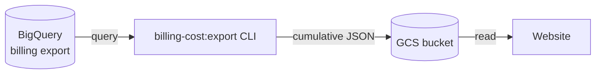

# GCP Billing Cost Report

## Overview

oboapp.online runs on Google Cloud Platform. This feature provides a public, operator-maintained snapshot of actual monthly GCP costs — letting users understand the infrastructure expenses behind the service.

## How It Works

When configured, Cloud Scheduler runs the `billing-cost-export` Cloud Run job on the 3rd of each month at 05:00 in `schedule_timezone` (Europe/Sofia by default). The delay allows time for billing export data to arrive. It queries the GCP billing export dataset in BigQuery, builds a cumulative JSON snapshot covering up to the last 12 full months (where data is available), and uploads it to the same GCS bucket used by other operational reports. The website reads this snapshot to display cost history. The CLI can also be run manually.


```mermaid
flowchart LR
    BQ[(BigQuery\nbilling export)] -->|query| S[billing-cost:export CLI]
    S -->|cumulative JSON| GCS[(GCS bucket)]
    GCS -->|read| W[Website]
```

## Workflow

1. **Run the export** near the start of each month:
   ```bash
   pnpm billing-cost:export
   ```
2. The script queries BigQuery for net costs (after credits) grouped by GCP service and calendar month.
3. A cumulative snapshot covering up to 12 months is uploaded to GCS, overwriting the previous version.
4. The website picks up the updated snapshot on its next request.

## CLI Script

Run from the `ingest/` directory:

```bash
# Export last 12 full months (recommended monthly cadence)
pnpm billing-cost:export

# Shorter window
pnpm billing-cost:export --months 6

# Also include the current partial month
pnpm billing-cost:export --include-current

# Preview output without uploading
pnpm billing-cost:export --dry-run
```

The script fails fast if required env vars are missing and warns (but does not fail) if the GCS bucket is not configured.

## Setup

### Scheduled production export

Set `billing_export` in Terraform and configure `gcs_generic_bucket`:

```hcl
billing_export = {
  project  = "your-billing-project"
  dataset  = "billing_export"
  table    = "gcp_billing_export_v1_YOUR_ACCOUNT"
  location = "EU" # Must match the dataset location
}
```

For GitHub deployment, set repository variables `BILLING_BIGQUERY_PROJECT`,
`BILLING_BIGQUERY_DATASET`, `BILLING_BIGQUERY_TABLE`, and
`BILLING_BIGQUERY_LOCATION` (defaults to `US`). The workflow passes these to
Terraform. Leaving the first three unset disables the billing job; partial
configuration fails validation. `GCS_GENERIC_BUCKET` must also be set.

Terraform enables the BigQuery API and grants the ingest runner
`roles/bigquery.jobUser` on the configured billing project and
`roles/bigquery.dataViewer` on the existing export dataset. The deployment
identity needs permission to enable that API and manage those IAM bindings,
including in the billing project if it differs from the ingest project.
If Terraform fails with `bigquery.datasets.update denied`, an administrator must
bootstrap the deployment identity's dataset access-management permissions before
retrying. A custom role avoids granting CI access to table data:

```sh
gcloud iam roles create billingDatasetIamManager --project=BILLING_PROJECT \
  --title="Billing Dataset IAM Manager" \
  --permissions=bigquery.datasets.get,bigquery.datasets.update,bigquery.datasets.getIamPolicy,bigquery.datasets.setIamPolicy \
  --stage=GA

gcloud projects add-iam-policy-binding BILLING_PROJECT \
  --member="serviceAccount:CI_SERVICE_ACCOUNT" \
  --role="projects/BILLING_PROJECT/roles/billingDatasetIamManager" \
  --condition="expression=resource.name == 'projects/BILLING_PROJECT/datasets/BILLING_DATASET',title=billing_export_dataset_only"
```

Replace the placeholders with the billing project, dataset and deployment service
account. The conditional project binding restricts these permissions to that one
dataset. This is a one-time administrator setup, separate from the report runner's
read-only dataset access managed by Terraform.

Dataset IAM resources must not be mixed with separately managed authorized-view
access entries on the same dataset.

Override `schedules.billing_cost_export` to change the cadence. The job uses
Application Default Credentials from its execution service account, the current
ingest image, a 600-second timeout and one retry. A log-based alert reports errors.
After deployment, generate the initial snapshot without waiting for next month:

```sh
gcloud run jobs execute billing-cost-export --project=YOUR_PROJECT --region=europe-west1 --wait
```

Verify `/api/billing/report` and `/author` afterward. Deployment alone does not
generate the file. Missing snapshots return 404; missing web bucket configuration
returns 503. Successful API responses are cached for one hour.

### Retention

The generic bucket's ten-day deletion rule applies only to `air-quality/`,
`geocode-cache/`, `heatmap/`, `interests/`, and `notifications/`. It excludes
`billing/`, so the latest billing snapshot remains until overwritten, even if a
monthly export fails. There is no separate billing history archive: each snapshot
contains the cumulative monthly data. GCS lifecycle changes can take up to 24 hours
to take effect; applying this change does not restore an already deleted report.

### Manual export

Add the following to `.env.local` (maintainer machine only — never committed):

| Variable                    | Description                                      |
| --------------------------- | ------------------------------------------------ |
| `BILLING_BIGQUERY_PROJECT`  | GCP project that owns the billing export dataset |
| `BILLING_BIGQUERY_DATASET`  | BigQuery dataset name                            |
| `BILLING_BIGQUERY_TABLE`    | Billing export table name                        |
| `BILLING_BIGQUERY_LOCATION` | Dataset region (default: `US`)                   |

Authentication uses Application Default Credentials. Run `gcloud auth application-default login` once before first use.

The `GCS_GENERIC_BUCKET` variable (already used by other reports) determines the upload destination.

## Data Shape

The snapshot is a single JSON file at `billing/cost-report.json` in `GCS_GENERIC_BUCKET`. It contains:

- Generation timestamp
- Currency code
- Monthly entries sorted newest-first, each with a total and a per-service breakdown

Services with credits exceeding their usage cost in a given month are excluded from that month's breakdown.

## Related

- [Ingest Pipeline](../../ingest/README.md) — operational commands and scheduling
