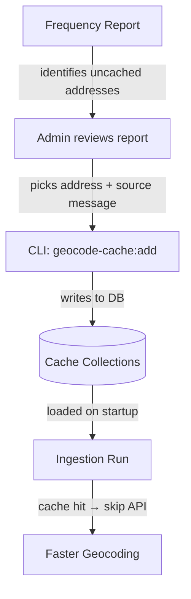
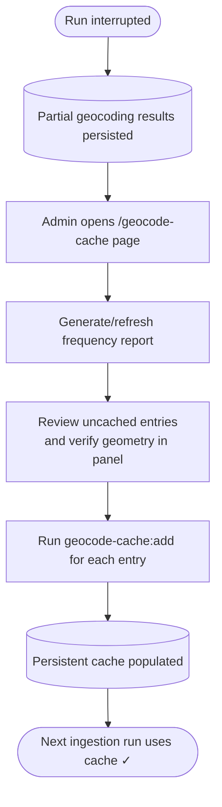

# Geocoding Cache

## Overview

Many messages contain the same addresses or street sections. Without caching, every ingestion run geocodes these from scratch — hitting Google and Overpass APIs repeatedly for identical lookups. The geocoding cache stores previously resolved locations in the database so they can be reused across runs, reducing API costs, latency, and external dependency.

## How It Works

The cache operates at two levels:

1. **Database (persistent)** — Two collections store cached pins (addresses → coordinates) and streets (street names → line geometries). Entries persist across runs and are populated manually via a CLI tool.
2. **In-memory (per-run)** — At the start of each ingestion run, all DB cache entries are loaded into memory. Geocoding checks memory first; on a hit, the API call is skipped entirely. The in-memory cache is rebuilt fresh on each run, so there's no stale-cache risk.

Cache invalidation is manual — an admin removes or refreshes entries as needed. Address geometries rarely change, so automatic expiry is unnecessary.

## Workflow



1. **Generate a frequency report** — a CLI script (or the weekly Cloud Scheduler job) scans finalized messages, counts how often each address/street appears, and uploads the report to GCS.
2. **Review in the admin page** — the `/geocode-cache` page shows the report, sorted by frequency, highlighting uncached entries.
3. **Pre-cache via CLI** — for each high-frequency uncached entry, run the `geocode-cache:add` script pointing at a message that already has valid geometry for that address.
4. **Automatic pickup** — the next ingestion run loads the new cache entries and skips API calls for those locations.

## Geocoding Progress

Geocoding calls external APIs and can take several minutes for messages with many locations. To avoid losing work if the ingestion process is interrupted, results are persisted to the database incrementally as they arrive. This means partial geocoding results are available in the admin page immediately — without waiting for a full ingestion run to complete.

When a run finishes successfully, the incremental entries are consolidated into a single final record for that message. If the run is interrupted, the partial entries remain and are still visible in the admin page geometry panel, so they can be promoted to the persistent cache right away.

## Recovery After Interrupted Runs



1. Open the `/geocode-cache` page and generate a fresh frequency report if needed.
2. For each address or street that appears uncached, open the geometry panel and verify the geometry looks correct.
3. Copy the `geocode-cache:add` command from the panel and run it.
4. On the next ingestion run, those addresses will be served from cache.

The interrupted message itself still needs to be re-ingested to produce a finalized result. This workflow is specifically about preserving the expensive API results so re-ingestion is cheap.

## Scheduling

The frequency report is generated automatically on a weekly schedule. The exact timing is configurable per environment.

## CLI Scripts

Both scripts run from the `ingest/` directory:

```bash
# Generate + upload frequency report to GCS
pnpm geocode-cache:report

# Pre-cache a pin or street geometry from an existing message
pnpm geocode-cache:add --message <id> --address "ул. Граф Игнатиев 10" --type pin
pnpm geocode-cache:add --message <id> --address "бул. Витоша" --type street

# Manually geocode a street with an alternate Overpass query, then review the result
# before caching it with geocode-cache:add
pnpm geocode-cache:geocode --street "ул. Ген. Гурко" --query "Gen. Gurko, Sofia" --message <id>

# Register a street name synonym (the canonical must already be cached)
pnpm geocode-cache:synonym --synonym "ул. Гурко" --canonical "ул. Ген. Гурко"
```

The frequency report script supports `--dry-run` to print results to stdout without uploading to GCS.

## Synonyms

Some streets appear in messages under multiple name variants (e.g. abbreviations, informal names, or transliterations). Instead of caching each variant separately, you can register a **synonym** that maps the alternative spelling to an already-cached canonical street:

```bash
pnpm geocode-cache:synonym --synonym "ул. Гурко" --canonical "ул. Ген. Гурко"
```

Requirements:
- The canonical street must already exist in `geocodeCacheStreets`.
- The synonym must not already be cached as a street or as another synonym.

At startup, the pipeline loads synonyms from the database and seeds the in-memory street geometry cache with the canonical geometry under the synonym's name. From that point on, messages containing the synonym get the correct geometry without any Overpass API call.

## Admin Page

The `/geocode-cache` page (linked from `/sources`) provides:

- **Frequency tables** for pins and streets — entries appearing more than once, sorted by count
- **Filters** — toggle between top 50 / all entries, and filter to uncached-only
- **Geometry visualization** — clicking an entry opens a side panel with a map showing markers (pins) or polylines (streets) from source messages. Partial results from interrupted runs appear here as soon as they are persisted.
- **Copy command** — each message row has buttons that copy ready-to-run commands to the clipboard:
  - `cache:add` — copies a `geocode-cache:add` command to cache the geometry directly from the source message
  - `cache:geocode` — (streets only) copies a `geocode-cache:geocode` command to re-geocode with an alternate Overpass query before caching
  - `cache:synonym` — (streets only) copies a `geocode-cache:synonym` command with the current street pre-filled as `--synonym` and a `<canonical>` placeholder for you to replace with the canonical street name

## Historical Data Limitation

The geocoding progress tracking described above (persisting incremental results into `process[]` on each message) was introduced on **3 April 2026**. Messages ingested before that date do not have `geocodingBatch` or `geocoding` entries in their `process[]` array. Their geocoded locations are only available via the top-level `pins` and `streets` fields, which are populated on finalization. Interrupted runs from before this date cannot be recovered via the admin page geometry panel.

## Related

- [Geocoding](../../ingest/geocoding/README.md) — routing, services, and rate limits
- [Message Ingest Pipeline](../../ingest/messageIngest/README.md) — where geocoding fits in the pipeline
