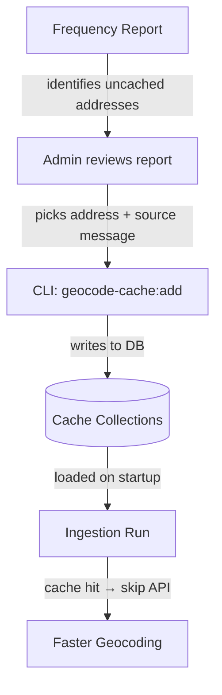

# Geocoding Cache

## Overview

Many messages contain the same addresses or street sections. Without caching, every ingestion run geocodes these from scratch — hitting Google and Overpass APIs repeatedly for identical lookups. The geocoding cache stores previously resolved locations in the database so they can be reused across runs, reducing API costs, latency, and external dependency.

## How It Works

The cache operates at two levels:

1. **Database (persistent)** — Two collections store cached pins (addresses → coordinates) and streets (street names → line geometries). Entries persist across runs and are populated manually via a CLI tool.
2. **In-memory (per-run)** — At the start of each ingestion run, all DB cache entries are loaded into memory. Geocoding checks memory first; on a hit, the API call is skipped entirely. The in-memory cache is rebuilt fresh on each run, so there's no stale-cache risk.

Cache invalidation is manual — an admin removes or refreshes entries as needed. Address geometries rarely change, so automatic expiry is unnecessary.

## Workflow



1. **Generate a frequency report** — a CLI script (or the weekly Cloud Scheduler job) scans finalized messages, counts how often each address/street appears, and uploads the report to GCS.
2. **Review in the admin page** — the `/geocode-cache` page shows the report, sorted by frequency, highlighting uncached entries.
3. **Pre-cache via CLI** — for each high-frequency uncached entry, run the `geocode-cache:add` script pointing at a message that already has valid geometry for that address.
4. **Automatic pickup** — the next ingestion run loads the new cache entries and skips API calls for those locations.

## Scheduling

The frequency report is generated automatically on a recurring weekly schedule via the cloud scheduler/job pipeline. The exact timing is configurable per environment; check the current infrastructure configuration for the active schedule if verification is needed.

## CLI Scripts

Both scripts run from the `ingest/` directory:

```bash
# Generate + upload frequency report to GCS
pnpm geocode-cache:report

# Pre-cache a single address from an existing message
pnpm geocode-cache:add -- --message <id> --address "ул. Граф Игнатиев 10" --type pin

# Pre-cache a street geometry from an existing message
pnpm geocode-cache:add -- --message <id> --address "бул. Витоша" --type street
```

The frequency report script supports `--dry-run` to print the top uncached pins and streets to stdout without uploading to GCS.

## Admin Page

The `/geocode-cache` page (linked from `/sources`) provides:

- **Frequency tables** for pins and streets — entries appearing more than once, sorted by count
- **Filters** — toggle between top 50 / all entries, and filter to uncached-only
- **Geometry visualization** — clicking an entry opens a side panel with a Google Map showing color-coded markers (pins) or polylines (streets) from the source messages
- **Copy command** — each message row has a button that copies the `geocode-cache:add` CLI command to the clipboard

## Related

- [Geocoding](../../ingest/geocoding/README.md) — routing, services, and rate limits
- [Message Ingest Pipeline](../../ingest/messageIngest/README.md) — where geocoding fits in the pipeline
- [Air Quality Storage](air-quality-storage.md) — uses the same `GCS_GENERIC_BUCKET` for file storage
