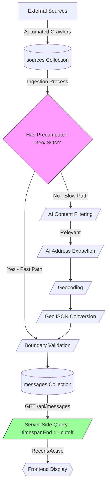
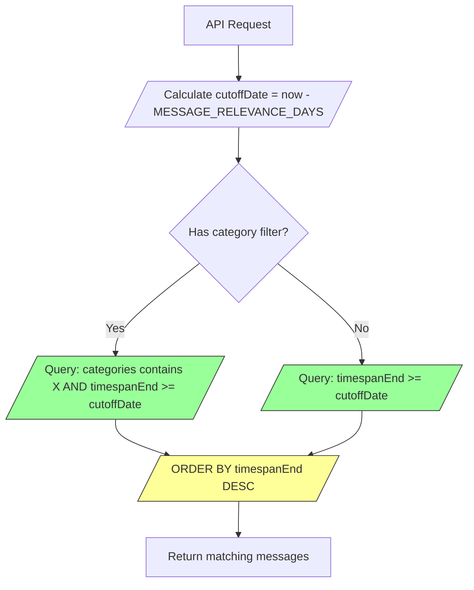

# Message Filtering

## Overview

Server-side Firestore queries filter messages by denormalized timespan fields, returning only messages with `timespanEnd >= cutoffDate`. Messages remain visible while events are ongoing plus a configurable grace period (`MESSAGE_RELEVANCE_DAYS`).

See [Geocoding System Overview](geocoding-overview.md) for location resolution details.

## Message Lifecycle

Messages flow through a multi-stage pipeline from initial crawling to final display on the map:



## Processing Paths

The system handles two types of data sources based on whether they provide pre-geocoded data:

### Fast Path (Pre-geocoded Sources)

Utility companies and service providers that publish data with geographic coordinates (APIs, GIS systems) bypass AI processing entirely. These messages proceed directly from boundary validation to storage.

**Processing**: Source Data → Boundary Check → Store GeoJSON → Finalize

**City-wide messages** (with `cityWide: true` field): Use empty GeoJSON, bypass viewport filtering in web API, use sofia.geojson boundary for notification matching.

### Slow Path (Text-based Sources)

Municipal announcements and HTML content require natural language processing to extract locations and timespans. These messages go through AI filtering, extraction, and geocoding.

**Processing**: Source Data → Content Filtering (LLM) → Address Extraction (LLM) → Geocoding (Google + OpenStreetMap) → GeoJSON Conversion → Finalize

## Relevance Filtering Logic

The relevance filter uses **server-side Firestore queries** to retrieve only messages with active or recent timespans. This eliminates the need to transfer and filter thousands of outdated messages on the client.

### Field Storage

**Denormalized Timespan Fields** (stored at message root):

- `timespanStart`: MIN start time across all timespans in the message (Date/Timestamp)
- `timespanEnd`: MAX end time across all timespans in the message (Date/Timestamp)

**Extraction Strategy**:

- **AI-extracted messages**: Computed from `extractedData.pins[].timespans` and `extractedData.streets[].timespans` during ingestion
- **Precomputed sources**: Copied from source document root fields (erm-zapad, toplo-bg, sofiyska-voda crawlers parse dates during crawl)
- **Fallback**: Uses `crawledAt` when no timespans available or dates invalid (before 2025-01-01)
- **Single date handling**: When only start OR end available, duplicates to both fields

**Example**: Message with pin timespans `10.01.2026 08:00 - 10.01.2026 12:00` and `15.01.2026 14:00 - 15.01.2026 18:00` → `timespanStart: 2026-01-10 08:00`, `timespanEnd: 2026-01-15 18:00`

### Configuration

**Environment Variable**: `MESSAGE_RELEVANCE_DAYS`

- **Default**: 7 days
- **Purpose**: Defines how long messages remain visible after their associated events end
- **Scope**: Server-side configuration (applies to all users)

### Filtering Algorithm

The system uses Firestore composite indexes to execute server-side queries:



**Firestore Query Pattern**:

```typescript
messagesRef
  .where("categories", "array-contains", category) // Optional
  .where("timespanEnd", ">=", cutoffDate)
  .orderBy("timespanEnd", "desc");
```

**Composite Index Required**:

- Fields: `categories` (array-contains) + `timespanEnd` (descending)
- OR: `timespanEnd` (descending) for uncategorized queries

### Dual-Criteria System

Timespan-based filtering uses denormalized `timespanEnd` field (MAX end time across all extracted timespans). Messages without valid timespans fall back to `timespanEnd = crawledAt`.

## Additional Filtering

Beyond time-based relevance, several filters operate at different pipeline stages:

- **Content Relevance** (AI): Applied during message ingestion, before geocoding. Large language model analyzes text to remove announcements unrelated to infrastructure (e.g., transport schedules, events, general news). Failed messages are marked as finalized without GeoJSON.

- **Boundary Filter**: Applied twice - pre-check during source ingestion for pre-geocoded data, and post-check after geocoding for AI-extracted locations. Uses geometric intersection with defined boundary polygons to ensure geographic relevance to the target region.

- **GeoJSON Validation**: Applied at the API endpoint before returning messages to frontend. Only messages with valid, non-null GeoJSON containing at least one feature are displayed. Messages that failed geocoding are filtered out here.

- **Source Age**: Applied during source ingestion, before message processing begins. Announcements older than 90 days from publication are ignored to reduce processing load on archived content.

## Ingestion Error Tracking

Messages that reach finalization (with or without GeoJSON) store internal ingestion issues in `ingestErrors`. Each entry has a human-readable `text` and a `type` (`warning`, `error`, or `exception`). This allows later inspection of why a message was finalized without appearing on the map.

**Operational view**: The /ingest-errors page lists finalized messages missing GeoJSON and displays any recorded `ingestErrors`.

## Frontend Display

Messages appear as red map features (points, lines, polygons). Clicking shows details including source, dates, locations, and timespans. The message grid below the map displays a limited number of recent items.

**Visibility Requirements** (all must be true):

1. Valid GeoJSON geometry
2. Processing completed (finalized)
3. Passes relevance filtering

**Updates**: Map requires manual refresh. Crawlers run on scheduled jobs multiple times per day.

## Edge Cases

- Mixed timespans: Uses MAX end date (`timespanEnd`)
- Invalid dates: Ignored; falls back to `crawledAt` if all invalid
- Boundary cases: Inclusive comparison (`timespanEnd >= cutoffDate`)
- Precomputed sources: Timespans extracted by crawlers, transferred to messages

## Configuration

`MESSAGE_RELEVANCE_DAYS` (default: 7) - Number of days messages remain visible after `timespanEnd`. Server restart required for changes.
