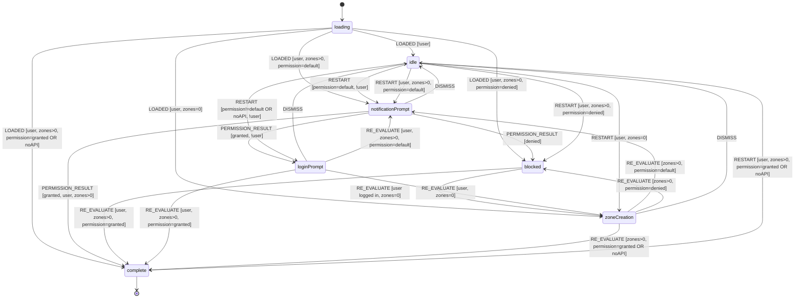

# Onboarding Flow

State machine hook for managing the user onboarding and engagement flow.

## Overview

This hook centralizes the onboarding UX logic for all users, guiding them through:

1. Notification permission prompt
2. Login
3. Zone creation

**Unauthenticated Users:** Land in `idle` state showing a "Получавай известия" button with a bell icon.
This keeps the UI clean and unobtrusive. The onboarding flow starts when the user
clicks the button, which dispatches `RESTART` and shows the `NotificationPrompt`.

**Header Login:** Logging in from the header re-evaluates the flow immediately.
If the user was idle and then logs in, the state advances (e.g., to zone creation)
without requiring a page refresh.

**Logout behavior:** Signing out no longer triggers the browser notification
permission prompt. When permission is not granted, logout skips FCM token cleanup
to avoid requesting permission during sign-out.

**Authenticated Users:** Land in the appropriate state based on their progress
(`zoneCreation`, `notificationPrompt`, `blocked`, or `complete`).

## Multi-Zone Support

Authenticated users can create multiple named zones of interest. Each zone has a **type**
(Дома, Офис, Родители, Училище, Фитнес, Друго) with a predefined color, and a configurable
radius (100–1000 m).

### Sidebar UI

When `complete`, the sidebar header shows a segmented control with two tabs:

| Tab            | Content                                                                 |
| -------------- | ----------------------------------------------------------------------- |
| **Моите зони** | `ZoneList` — clickable list of saved zones (color dot, label, radius)   |
| **Събития**    | `MessagesGrid` — all messages visible in the map viewport              |

In "Моите зони" mode the messages list is filtered to only show messages that
intersect at least one of the user's zones (`isMessageInAnyInterestZone`).
City-wide messages are always included.

A "Добави зона" button (visible only in the zones tab) opens the `AddZoneModal`.

### Zone Creation Flow

1. User clicks "Добави зона" → `AddZoneModal` opens with a 3×2 grid of zone types and a radius slider.
2. User picks a type and radius, clicks confirm → modal closes, map enters **target mode**.
3. User clicks the map to place the zone (no preview circle until first click).
4. Control panel shows coordinates, radius slider, and save/cancel buttons.
5. On save, the zone is persisted via `POST /api/interests` with `label` and `color`.

### Zone Editing & Deletion

Right-clicking (or tapping) a zone circle on the map opens `InterestContextMenu`
with **Move** and **Delete** actions. Move re-enters target mode with the existing
radius pre-filled.

### Interest Data Model

Zones are stored in the `interests` collection with these fields:

| Field         | Type     | Description                            |
| ------------- | -------- | -------------------------------------- |
| `userId`      | string   | Owner                                  |
| `coordinates` | {lat,lng}| Center of the zone                     |
| `radius`      | number   | Radius in meters (100–1000)            |
| `label`       | string?  | Zone type label (e.g. "Дома")          |
| `color`       | string?  | Hex color from zone type (e.g. "#3B82F6") |
| `createdAt`   | datetime | Creation timestamp                     |
| `updatedAt`   | datetime | Last update timestamp                  |

### Notifications

The notification pipeline matches messages against **all** of a user's zones.
A user receives at most one notification per message regardless of how many
zones it intersects (deduplicated by closest match distance).

### Map Rendering

Zone circles use native `google.maps.Circle` instances managed imperatively
(not via the `@react-google-maps/api` `<Circle>` component) to ensure
deterministic cleanup — no ghost circles on delete or radius change.
Each circle is color-coded to match its zone type.

## State Machine Diagram

## States

| State                | Description                                                     | UI Shown                                              |
| -------------------- | --------------------------------------------------------------- | ----------------------------------------------------- |
| `loading`            | Initial state while checking subscriptions                      | LoadingButton ("Зарежда се..." + spinner)             |
| `notificationPrompt` | Ask user about notifications                                    | NotificationPrompt                                    |
| `blocked`            | Notifications blocked at browser/OS level                       | BlockedNotificationsPrompt                            |
| `loginPrompt`        | Ask user to log in                                              | LoginPrompt                                           |
| `zoneCreation`       | User logged in but has no zones                                 | AddInterestsPrompt                                    |
| `complete`           | Fully onboarded                                                 | AddInterestButton ("Добави зона")                     |
| `idle`               | Initial state for unauthenticated users, or user dismissed flow | NotificationButton ("Получавай известия" + bell icon) |

## Actions

| Action              | Description                                | Valid From                                          |
| ------------------- | ------------------------------------------ | --------------------------------------------------- |
| `LOADED`            | Initial load with context                  | `loading`                                           |
| `PERMISSION_RESULT` | Browser permission result                  | `notificationPrompt`                                |
| `DISMISS`           | User dismissed current prompt              | `notificationPrompt`, `loginPrompt`, `zoneCreation` |
| `RESTART`           | Re-enter flow from idle                    | `idle`                                              |
| `RE_EVALUATE`       | External state changed (user, zones, etc.) | All                                                 |

> **Note:** The `blocked` state has no user actions. Users can only exit via `RE_EVALUATE` when they enable notifications in browser settings.
