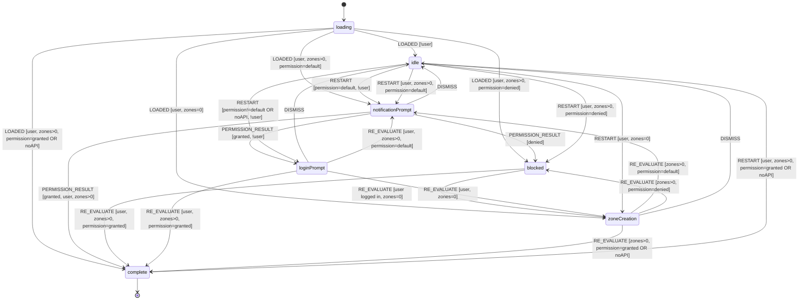

# Onboarding Flow

State machine hook for managing the user onboarding and engagement flow.

## Overview

This hook centralizes the onboarding UX logic for all users, guiding them through:

1. Notification permission prompt
2. Login
3. Zone creation

**Unauthenticated Users:** Land in `idle` state showing a "Получавай известия" button with a bell icon.
This keeps the UI clean and unobtrusive. The onboarding flow starts when the user
clicks the button, which dispatches `RESTART` and shows the `NotificationPrompt`.

**Header Login:** Logging in from the header re-evaluates the flow immediately.
If the user was idle and then logs in, the state advances (e.g., to zone creation)
without requiring a page refresh.

**Logout behavior:** Signing out no longer triggers the browser notification
permission prompt. When permission is not granted, logout skips FCM token cleanup
to avoid requesting permission during sign-out.

**Authenticated Users:** Land in the appropriate state based on their progress
(`zoneCreation`, `notificationPrompt`, `blocked`, or `complete`).

## State Machine Diagram

## States

| State                | Description                                                     | UI Shown                                              |
| -------------------- | --------------------------------------------------------------- | ----------------------------------------------------- |
| `loading`            | Initial state while checking subscriptions                      | LoadingButton ("Зарежда се..." + spinner)             |
| `notificationPrompt` | Ask user about notifications                                    | NotificationPrompt                                    |
| `blocked`            | Notifications blocked at browser/OS level                       | BlockedNotificationsPrompt                            |
| `loginPrompt`        | Ask user to log in                                              | LoginPrompt                                           |
| `zoneCreation`       | User logged in but has no zones                                 | AddInterestsPrompt                                    |
| `complete`           | Fully onboarded                                                 | AddInterestButton ("Добави зона")                     |
| `idle`               | Initial state for unauthenticated users, or user dismissed flow | NotificationButton ("Получавай известия" + bell icon) |

## Actions

| Action              | Description                                | Valid From                                          |
| ------------------- | ------------------------------------------ | --------------------------------------------------- |
| `LOADED`            | Initial load with context                  | `loading`                                           |
| `PERMISSION_RESULT` | Browser permission result                  | `notificationPrompt`                                |
| `DISMISS`           | User dismissed current prompt              | `notificationPrompt`, `loginPrompt`, `zoneCreation` |
| `RESTART`           | Re-enter flow from idle                    | `idle`                                              |
| `RE_EVALUATE`       | External state changed (user, zones, etc.) | All                                                 |

> **Note:** The `blocked` state has no user actions. Users can only exit via `RE_EVALUATE` when they enable notifications in browser settings.
