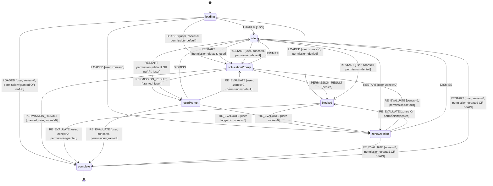

# Onboarding Flow

State machine hook for managing the user onboarding and engagement flow.

## Overview

This hook centralizes the onboarding UX logic for all users, guiding them through:

1. Notification permission prompt
2. Guest usage (anonymous Firebase account)
3. Optional Google login upgrade
4. Zone creation

## Anonymous-first behavior

- The app creates a Firebase anonymous account on first open.
- Guest users can create zones and enable push notifications on the current device.
- Guest data persists until browser/app data is cleared.
- If anonymous auth is temporarily unavailable, UI surfaces a Google sign-in path instead of guest actions.

## Guest-to-Google upgrade prompt

When a guest user logs in with Google and **both** guest + account already have data,
the app shows a mandatory conflict prompt:

- Title: **„Как да използваме данните ти?“**
- Body: **„Открихме данни от гост режим и от профила ти. Избери как да продължим.“**
- Options:
  - **„Импортирай“** (moves guest data into account)
  - **„Запази отделно“** (no data movement)
  - **„Замени“** (replaces account context with guest context)

No silent merge/overwrite occurs when both sides have data.

The prompt is blocking: users must choose one of the three options to continue.

**Unauthenticated Users:** Land in `idle` state showing a "Получавай известия" button with a bell icon.
This keeps the UI clean and unobtrusive. The onboarding flow starts when the user
clicks the button, which dispatches `RESTART` and shows the `NotificationPrompt`.

**Header Login:** Logging in from the header re-evaluates the flow immediately.
If the user was idle and then logs in, the state advances (e.g., to zone creation)
without requiring a page refresh.

**Logout behavior:** Signing out no longer triggers the browser notification
permission prompt. When permission is not granted, logout skips FCM token cleanup
to avoid requesting permission during sign-out.

**Authenticated Users:** Land in the appropriate state based on their progress
(`zoneCreation`, `notificationPrompt`, `blocked`, or `complete`).

## State Machine Diagram

```mermaid
stateDiagram-v2
    [*] --> loading

    loading --> idle : LOADED [!user]
    loading --> zoneCreation : LOADED [user, zones=0]
    loading --> notificationPrompt : LOADED [user, zones>0, permission=default]
    loading --> blocked : LOADED [user, zones>0, permission=denied]
    loading --> complete : LOADED [user, zones>0, permission=granted OR noAPI]

    notificationPrompt --> blocked : PERMISSION_RESULT [denied]
    notificationPrompt --> loginPrompt : PERMISSION_RESULT [granted, !user]
    notificationPrompt --> complete : PERMISSION_RESULT [granted, user, zones>0]
    notificationPrompt --> idle : DISMISS

    blocked --> zoneCreation : RE_EVALUATE [user logged in, zones=0]
    blocked --> complete : RE_EVALUATE [user, zones>0, permission=granted]

    loginPrompt --> idle : DISMISS
    loginPrompt --> zoneCreation : RE_EVALUATE [user, zones=0]
    loginPrompt --> notificationPrompt : RE_EVALUATE [user, zones>0, permission=default]
    loginPrompt --> complete : RE_EVALUATE [user, zones>0, permission=granted]

    zoneCreation --> notificationPrompt : RE_EVALUATE [zones>0, permission=default]
    zoneCreation --> blocked : RE_EVALUATE [zones>0, permission=denied]
    zoneCreation --> complete : RE_EVALUATE [zones>0, permission=granted OR noAPI]
    zoneCreation --> idle : DISMISS

    idle --> notificationPrompt : RESTART [permission=default, !user]
    idle --> loginPrompt : RESTART [permission!=default OR noAPI, !user]
    idle --> zoneCreation : RESTART [user, zones=0]
    idle --> notificationPrompt : RESTART [user, zones>0, permission=default]
    idle --> blocked : RESTART [user, zones>0, permission=denied]
    idle --> complete : RESTART [user, zones>0, permission=granted OR noAPI]

    complete --> [*]
```

## States

| State                | Description                                                     | UI Shown                                              |
| -------------------- | --------------------------------------------------------------- | ----------------------------------------------------- |
| `loading`            | Initial state while checking subscriptions                      | LoadingButton ("Зарежда се..." + spinner)             |
| `notificationPrompt` | Ask user about notifications                                    | NotificationPrompt                                    |
| `blocked`            | Notifications blocked at browser/OS level                       | BlockedNotificationsPrompt                            |
| `loginPrompt`        | Ask user to log in                                              | LoginPrompt                                           |
| `zoneCreation`       | User logged in but has no zones                                 | AddInterestsPrompt                                    |
| `complete`           | Fully onboarded                                                 | AddInterestButton ("Добави зона")                     |
| `idle`               | Initial state for unauthenticated users, or user dismissed flow | NotificationButton ("Получавай известия" + bell icon) |

## Actions

| Action              | Description                                | Valid From                                          |
| ------------------- | ------------------------------------------ | --------------------------------------------------- |
| `LOADED`            | Initial load with context                  | `loading`                                           |
| `PERMISSION_RESULT` | Browser permission result                  | `notificationPrompt`                                |
| `DISMISS`           | User dismissed current prompt              | `notificationPrompt`, `loginPrompt`, `zoneCreation` |
| `RESTART`           | Re-enter flow from idle                    | `idle`                                              |
| `RE_EVALUATE`       | External state changed (user, zones, etc.) | All                                                 |

> **Note:** The `blocked` state has no user actions. Users can only exit via `RE_EVALUATE` when they enable notifications in browser settings.
