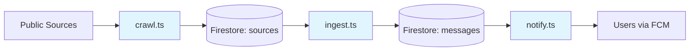

# Ingest Pipeline

Data collection and processing pipeline for OboApp. Collects infrastructure disruption notices from public sources (water, heating, road repairs) across Sofia, processes them into geocoded GeoJSON, and delivers notifications to interested users.

## ⚠️ WORKSPACE SETUP

This package is part of a pnpm workspace. **Run `pnpm install` at the repository root**, not in this directory.

The shared package (@oboapp/shared) is built automatically during workspace installation via postinstall hook.

## Pipeline Overview



## Components

- **[crawlers/](crawlers/README.md)** - Automated scrapers that fetch raw data from external sources
- **[messageIngest/](messageIngest/README.md)** - Processing pipeline: AI extraction → geocoding → GeoJSON conversion
- **[notifications/](notifications/README.md)** - Geographic matching and push notification delivery

## Usage

```bash
# Run a specific crawler
pnpm crawl -- --source rayon-oborishte-bg

# Sync GTFS bus stop data
pnpm gtfs-stops

# Process all sources into messages
pnpm ingest

# Send notifications for new messages
pnpm notify

# Run emergent pipeline (erm-zapad, toplo-bg, sofiyska-voda + ingest + notify)
pnpm pipeline:emergent

# Run full pipeline (all crawlers + ingest + notify)
pnpm pipeline:all
```

## Pipeline Schedules

The system runs two automated pipelines via Cloud Scheduler:

- **GTFS Sync** (`gtfs-stops`) - Daily at 3:00 AM EET
  - Downloads latest GTFS static data from Sofia Traffic
  - Updates bus stop coordinates in Firestore
  - Enables geocoding of messages containing bus stop codes

- **Emergent Pipeline** (`pipeline:emergent`) - Every 30 minutes, 7:00AM-10:30PM
  - Crawlers: erm-zapad, toplo-bg, sofiyska-voda
  - Runs ingest and notify after crawling
  - Handles short-lived messages and emergency works

- **Full Pipeline** (`pipeline:all`) - 3 times daily (10:00, 14:00, 16:00 EET)
  - Crawlers: All sources (rayon-oborishte-bg, sofia-bg, mladost-bg, studentski-bg, sredec-sofia-org, so-slatina-org, lozenets-sofia-bg, nimh-severe-weather, plus emergent crawlers)
  - Runs ingest and notify after crawling
  - Handles regularly scheduled announcements

## Deployment

Dockerized for Google Cloud Run Jobs. See `Dockerfile` and `terraform/` directory.
