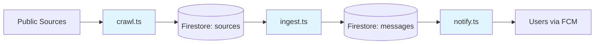

# Ingest Pipeline

Data collection and processing pipeline for OboApp. Collects infrastructure disruption notices from public sources (water, heating, road repairs) across Sofia, processes them into geocoded GeoJSON, and delivers notifications to interested users.

## ⚠️ WORKSPACE SETUP

This package is part of a pnpm workspace. **Run `pnpm install` at the repository root**, not in this directory.

The shared package (@oboapp/shared) is built automatically during workspace installation via postinstall hook.

## Pipeline Overview


```mermaid
graph LR
    A[Public Sources] --> B[crawl.ts]
    B --> C[(Firestore: sources)]
    C --> D[ingest.ts]
    D --> E[(Firestore: messages)]
    E --> F[notify.ts]
    F --> G[Users via FCM]

    style B fill:#e1f5ff
    style D fill:#e1f5ff
    style F fill:#e1f5ff
```

## Components

- **[crawlers/](crawlers/README.md)** - Automated scrapers that fetch raw data from external sources
- **[messageIngest/](messageIngest/README.md)** - Processing pipeline: AI extraction → geocoding → GeoJSON conversion
- **[geocoding/](geocoding/README.md)** - Geocoding services (Google, Overpass, Cadastre, GTFS) with persistent cache
- **[notifications/](notifications/README.md)** - Geographic matching and push notification delivery

## Usage

```bash
# Run a specific crawler
pnpm crawl --source rayon-oborishte-bg

# Sync GTFS bus stop data
pnpm gtfs-stops

# Process all sources into messages
pnpm ingest

# Send notifications for new messages
pnpm notify

# Run emergent pipeline (emergent crawlers + ingest + notify)
pnpm pipeline:emergent

# Run full pipeline (all crawlers + ingest + notify)
pnpm pipeline:all

# Generate geocoding frequency report (uploads to GCS)
pnpm geocode-cache:report

# Pre-cache a geocoded address/street from an existing message
pnpm geocode-cache:add --message <id> --address "..." --type pin|street
```

## Pipeline Schedules

The system runs two automated pipelines via Cloud Scheduler:

- **GTFS Sync** (`gtfs-stops`) - Daily at 3:00 AM EET
  - Downloads latest GTFS static data from Sofia Traffic
  - Updates bus stop coordinates in Firestore
  - Enables geocoding of messages containing bus stop codes

- **Educational Facilities Sync** (`educational-facilities-sync`) - Monthly on the 1st at 4:00 AM EET
  - Downloads schools and kindergartens from Sofia open data (sofiaplan.bg)
  - Updates facility coordinates in database
  - Enables geocoding of messages referencing numbered schools and kindergartens

- **Emergent Pipeline** (`pipeline:emergent`) - Every 30 minutes, 7:00AM-10:30PM
  - Crawlers: Sources that publish short-lived disruptions
  - Runs ingest and notify after crawling
  - Handles short-lived messages and emergency works

- **Full Pipeline** (`pipeline:all`) - 3 times daily (10:00, 14:00, 16:00 EET)
  - Crawlers: All sources
  - Runs ingest and notify after crawling
  - Handles regularly scheduled announcements

## Deployment

Dockerized for Google Cloud Run Jobs. See `Dockerfile` and `terraform/` directory.

## Testing Toolchain Note

`ingest/` currently pins `vitest@3.2.4` (with `vite@6`) while `web/` uses Vitest 4.

Reason: in this workspace/runtime, `ingest` hit an `ERR_REQUIRE_ESM` startup failure with Vitest 4 + Vite 7 when loading `vitest.config.ts`. Pinning `ingest` to the Vitest 3 toolchain restores stable test execution (`pnpm test:run`) for crawler and pipeline tests.

This is a temporary compatibility pin. We should align versions again once the workspace/runtime is upgraded or the upstream compatibility issue is resolved.

## AI Prompt Evaluation

The three AI pipeline prompts (filter-split, categorize, extract-locations) are evaluated using [promptfoo](https://www.promptfoo.dev/). Eval configs live in `prompts/__evals__/`.

**Prerequisites:** `GOOGLE_AI_API_KEY` and `GOOGLE_AI_MODEL` env vars must be set (same as for integration tests).
