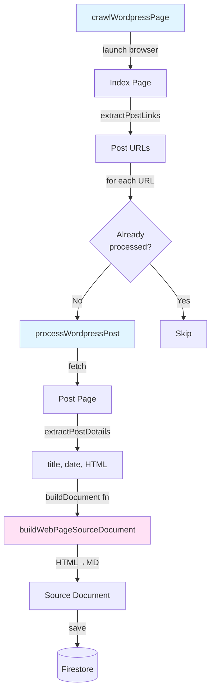
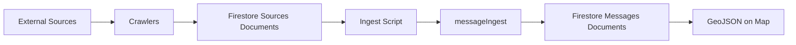

# Crawlers

Automated data collectors that fetch public notifications and disruptions from external sources, storing them as raw documents in Firestore.

## Available Crawlers

- **rayon-oborishte-bg** - Scrapes repair/disruption notices from Rayon Oborishte's website
- **sredec-sofia-org** - Scrapes public infrastructure announcements from Rayon Sredec's website
- **mladost-bg** - Scrapes repair/disruption notices from Rayon Mladost's website
- **studentski-bg** - Scrapes construction/maintenance schedules from Rayon Studentski's website
- **so-slatina-org** - Scrapes repair/disruption notices from Rayon Slatina's website
- **sofia-bg** - Scrapes municipal repair announcements and traffic changes from Sofia.bg
- **sofiyska-voda** - Fetches water supply disruptions from Sofiyska Voda's ArcGIS API
- **toplo-bg** - Fetches heating infrastructure incidents from Toplo.bg with pre-geocoded polygons
- **erm-zapad** - Fetches power outage incidents from ERM-Zapad for София-град municipalities
- **nimh-severe-weather** - Fetches severe weather warnings from NIMH (weather.bg) for Sofia

## How They Work

Each crawler:

1. Fetches raw data from its source (web scraping or API)
2. Extracts structured information (title, content, dates, URLs)
3. Stores documents in Firestore with `sourceType` identifier
4. Tracks processed URLs to avoid duplicates

### Crawler Architecture

WordPress-style crawlers (rayon-oborishte-bg, sredec-sofia-org, sofia-bg, mladost-bg, studentski-bg, so-slatina-org) use shared utilities from `shared/webpage-crawlers.ts`:

- **`crawlWordpressPage`** - Manages browser, extracts post links from index page, handles deduplication, processes each post
- **`processWordpressPost`** - Fetches post details, builds document via custom builder function, saves to Firestore
- **`buildWebPageSourceDocument`** - Converts HTML to Markdown, parses dates (supports custom date parsers)



### Markdown Text Handling

Crawlers handle message formatting differently based on whether they provide precomputed GeoJSON:

**Crawlers with precomputed GeoJSON** (erm-zapad, toplo-bg, sofiyska-voda, nimh-severe-weather):

- Skip the AI filtering and extraction pipeline
- Must store formatted text in both `message` and `markdownText` fields
- The `markdownText` field is used for display in the message details view
- Can produce markdown (erm-zapad, sofiyska-voda) or plain text (toplo-bg)
- **City-wide messages** (nimh-severe-weather): Set `cityWide: true` with empty FeatureCollection for alerts applying to the entire city (reusable pattern for city-wide infrastructure alerts)

**Crawlers without GeoJSON** (rayon-oborishte-bg, sredec-sofia-org, sofia-bg, mladost-bg, studentski-bg, so-slatina-org):

- Go through the full AI extraction pipeline
- Store HTML content converted to markdown in `message` field only
- The AI extraction stage produces `extractedData.markdown_text` for display
- Don't need to set `markdownText` in source documents

## Running Crawlers

```bash
# Run a specific crawler
npx tsx crawl --source rayon-oborishte-bg
npx tsx crawl --source sredec-sofia-org
npx tsx crawl --source mladost-bg
npx tsx crawl --source studentski-bg
npx tsx crawl --source so-slatina-org
npx tsx crawl --source sofiyska-voda
npx tsx crawl --source toplo-bg
npx tsx crawl --source sofia-bg
npx tsx crawl --source erm-zapad
npx tsx crawl --source nimh-severe-weather

# List available sources
npx tsx crawl --help
```

## Data Pipeline



After crawlers store raw documents in the `sources` collection, use the ingest script to process them:

```bash
# Process all sources within Oborishte boundaries
npx tsx ingest --boundaries messageIngest/boundaries/oborishte.geojson

# Process sources from a specific crawler
npx tsx ingest --source-name sofiyska-voda

# Dry run to preview
npx tsx ingest --dry-run --source-name rayon-oborishte-bg
```

The ingest script runs each source through the [messageIngest](../messageIngest) pipeline to extract addresses, geocode locations, and generate map-ready GeoJSON features.
