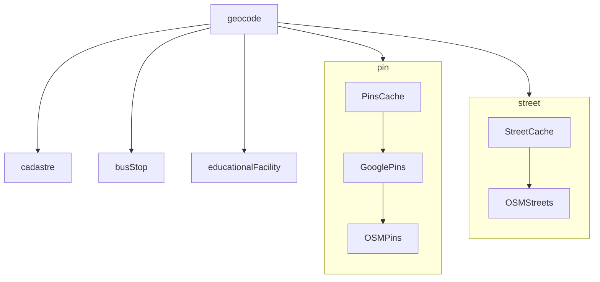

# Reworked geocoding: ideated state



```js
interface PinGeocoder {
    function geocodePin(location, context): null |
    ...
}


class ExamplePinsGeocoder {
    function geocode({type, location, context}) {
        if (foundCoordindates) {
            return foundCoordinates
        }
        return null
    }

    function done(locationsMap) {
        // Just getting notified what was geocoded.
        // This potentially allows caching.
    }
}
```

```js
export function geocode(context) {
    const out = {}
    out = {...out, ...geocodePins(context)}
    return out;
}

function geocodePins(context) {
    const out = {}

    if (!context.pins) {
        return out
    }

    for (const location of context.pins) {
        for (const provider of providers) {
            const coordinates = provider.geocodePin({
                location,
                context
            })

            if (null === coordinates) {
                continue
            }

            out{location} = coordinates
            break
        }
    }

    for (const provider of providers) {
        provider.done(out)
    }

    return out
}

...
```

```js
geocode({
  locality: "bg.sofia",
  ...context, // includes as much info as possible
  // (e.g. all locations that need geocoding (streets, pins, cadastre, etc.))
  // so that the geocoder can potentially increase its accuracy
});
```

```js
// providers.js
const providers = {
  pin: [
    new CachePinsGeocoder(),
    new GooglePinsGeocoder(),
    new OsmPinsGeocoder(),
  ],
  street: [new CacheStreetsGeocoder(), new OsmStreetsGeocoder()],
  cadastre: [new CadastreGeocoder()],
  ...
};
```

## Main purpose

The main purpose of the refactor is to allow for easy composition as described in providers.js above. This way a fork only needs to change this single file to reorganize the existing geocoding providers or inject a new one. A secondary aim is to make geocoding a black box as viewed from outside - while it is currently baked into messageIngest, the goal would be to have messageIngest call geocode() and just rely on the results of it.

## Important ideas

- Supported types of entities (pins, streets, cadastral, bus stops, educational facitilies) are enumerated.
- We are coding to interface. There is an interface for each type of entity that is supported.
- Each Geocoder is following one interface or more - separate interfaces per entity type.
- If a geocoder returns results other than null, the next geocoder by priority is not called.
- Caching is removed from the current implementation. It will be added as a separate Geocoder implementation at a later point.
