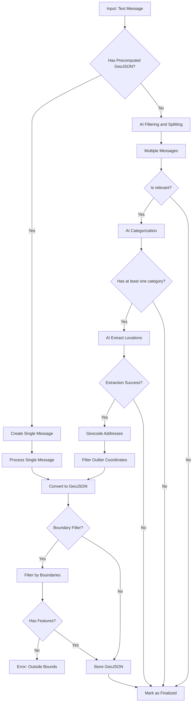

# Message Ingest Pipeline

This directory contains the message ingest pipeline that filters, categorizes, extracts locations, geocodes, and generates GeoJSON data from messages about public infrastructure disruptions in Sofia, Bulgaria.

## Pipeline Flow

## Pipeline Stages

The AI pipeline is split into three discrete steps, each with its own prompt and schema:

### 1. Filter & Split (AI-powered)

Prompt: [`prompts/filter-split.md`](../prompts/filter-split.md)

- **Splitting** - A single source text may describe multiple independent disruptions; this step splits them into separate messages
- **Relevance** - Each split message is marked as relevant or irrelevant
- **Responsible Entity** - Extracts the organization responsible for the disruption
- **Text Normalization** - Produces `plainText` (normalized plain text) and `markdownText` (formatted markdown for display)
- **Early Exit** - Irrelevant messages are finalized immediately and skip further processing

### 2. Categorize (AI-powered)

Prompt: [`prompts/categorize.md`](../prompts/categorize.md)

- **Pure classification** - Assigns infrastructure categories (water, heating, traffic, construction, etc.)
- **No extraction** - This step only classifies; it does not extract locations or other structured data
- **Early Exit** - Messages with no matching categories are finalized

### 3. Extract Locations (AI-powered)

Prompt: [`prompts/extract-locations.md`](../prompts/extract-locations.md)

- **Pins** - Specific addresses with building numbers
- **Streets** - Street segments with from/to intersections
- **Cadastral Properties** - УПИ (property) identifiers
- **Bus Stops** - Public transport stop names
- **City-wide flag** - Whether the disruption affects the entire city
- **Timespan denormalization** - `timespanStart = MIN(all starts)`, `timespanEnd = MAX(all ends)` across all extracted locations
- **Early Exit** - If extraction fails, the message is finalized without geocoding

### Geocoding Stage

Converts extracted locations to map coordinates using four specialized services:

- **Geocode Addresses** - Google API for pins, Overpass API for streets, Cadastre API for УПИ properties, GTFS data for bus stops
- **Filter Outliers** - Remove coordinates >1km from others
- **Store Geocoding** - Save validated coordinates

See [Geocoding System Overview](../../docs/features/geocoding-overview.md) for service details, rate limiting, and configuration.

### GeoJSON Stage

- **Convert to GeoJSON** - Create Point/LineString/Polygon features
- **Boundary Filtering** - Optional geographic bounds check
- **Store GeoJSON** - Save final geometry
- **Finalize** - Mark message as complete

### Precomputed GeoJSON Path

Sources with ready GeoJSON bypass the AI pipeline:

- Single message per source (1:1 relationship)
- Timespans transfer from source to message if present
- Validation against minimum date threshold
- Fallback to `crawledAt` if source lacks valid timespans

## Firestore Storage

Each pipeline step appends an entry to the message document's `process` array, creating an audit trail. Location data (pins, streets, cadastral properties, bus stops) is stored as denormalized root-level fields on the message document.
