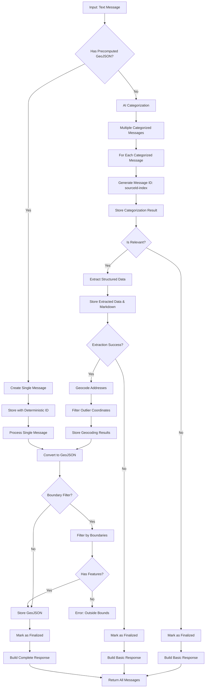

# Message Ingest Pipeline

This directory contains the message ingest pipeline that categorizes, extracts, geocodes, and generates GeoJSON data from messages about public infrastructure disruptions in Sofia, Bulgaria.

## Pipeline Flow

## Pipeline Stages

### Categorization Stage (AI-powered)

- **AI Categorization** - Single text input → multiple categorized messages with rich metadata
- **Categories** - Infrastructure types: water, heating, traffic, construction, etc.
- **Geographic Scope** - City-wide vs. specific addresses, coordinates, bus stops, УПИ properties
- **Relevance Decision** - Each categorized message marked as relevant/irrelevant
- **Normalized Text** - Clean text for downstream processing
- **Early Exit** - If irrelevant, finalize and skip geocoding

### Extraction Stage (AI-powered)

Extracts structured data and denormalizes timespans for Firestore queries:

- Parse locations, times, entities from normalized text
- Extract ALL timespans from pins, streets, cadastral properties
- Denormalize: `timespanStart = MIN(all starts)`, `timespanEnd = MAX(all ends)`
- Validate against minimum date threshold
- Fallback: `timespanStart/End = crawledAt` if no valid timespans
- Early exit if extraction fails

### Geocoding Stage

Converts extracted locations to map coordinates using four specialized services:

- **Geocode Addresses** - Google API for pins, Overpass API for streets, Cadastre API for УПИ properties, GTFS data for bus stops
- **Filter Outliers** - Remove coordinates >1km from others
- **Store Geocoding** - Save validated coordinates

See [Geocoding System Overview](../../docs/features/geocoding-overview.md) for service details, rate limiting, and configuration.

### GeoJSON Stage

- **Convert to GeoJSON** - Create Point/LineString/Polygon features
- **Boundary Filtering** - Optional geographic bounds check
- **Store GeoJSON** - Save final geometry
- **Finalize** - Mark message as complete

### Precomputed GeoJSON Path

Sources with ready GeoJSON bypass AI categorization:

- Single message per source (1:1 relationship)
- Timespans transfer from source to message if present
- Validation against minimum date threshold
- Fallback to `crawledAt` if source lacks valid timespans
