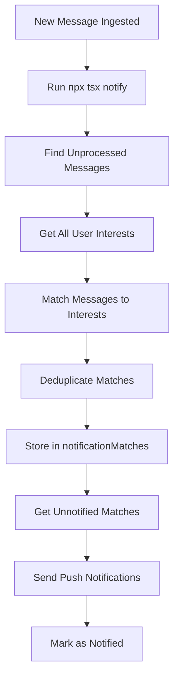

# Notifications System

This directory contains the notification matching and delivery system for OboApp.

## Overview

The notification system automatically notifies users when new messages are posted that match their areas of interest. It consists of:

1. **Client-side permission management** - Requests notification permissions and manages FCM subscriptions
2. **Server-side matching** - Matches messages with user interests based on geographic proximity
3. **Push notification delivery** - Sends notifications via Firebase Cloud Messaging

## How It Works

### User Flow

1. User logs in and adds their first interest circle, OR user logs in from a new device
2. System automatically requests notification permission
3. If granted, FCM token is generated and stored in Firebase
4. User receives notifications when new messages match their interests

### Notification Trigger Flow



## Components

### Client-Side

**`lib/notification-service.ts`**

- Requests notification permissions
- Manages FCM subscriptions
- Handles foreground messages
- Stores tokens in Firebase

**`lib/hooks/useInterests.ts`**

- Triggers notification permission request when circles are shown
- Checks if subscription is valid on login

**`public/firebase-messaging-sw.js`**

- Service worker for background push notifications
- Handles notification clicks

### Server-Side

**`lib/notifications/match-and-notify.ts`**

- Main script that runs after ingestion
- Identifies unprocessed messages
- Matches messages with user interests using geographic intersection
- Deduplicates matches (one notification per user per message)
- Sends push notifications via FCM
- Marks matches as processed

**`app/api/notifications/subscription/route.ts`**

- API endpoint for managing notification subscriptions
- GET - Check if user has subscription
- POST - Create/update subscription
- DELETE - Remove subscription

## Database Collections

### `notificationSubscriptions`

Stores FCM tokens for push notifications.

```typescript
{
  id: string;
  userId: string;
  token: string; // FCM token
  endpoint: string;
  createdAt: Date;
  updatedAt: Date;
  deviceInfo?: {
    userAgent?: string;
  };
}
```

### `notificationMatches`

Stores matches between messages and user interests.

```typescript
{
  id: string;
  userId: string;
  messageId: string;
  interestId: string;
  matchedAt: Date;
  notified: boolean;
  notifiedAt?: Date;
  notificationError?: string;
  distance?: number; // meters from interest center
}
```

## Running the Notification Script

The notification script should be run after message ingestion:

```bash
# Run ingestion first
pnpm ingest

# Then run notifications
pnpm notify
```

For automated workflows, combine them:

```bash
pnpm ingest && pnpm notify
```

## Setup Requirements

### Environment Variables

Add these to your `.env.local`:

```bash
# Firebase Cloud Messaging
NEXT_PUBLIC_FIREBASE_VAPID_KEY=your_vapid_key_here

# Optional: Custom app URL for notification links
APP_URL=https://your-domain.com
```

### Firebase Console Setup

1. Go to Firebase Console → Project Settings → Cloud Messaging
2. Generate a Web Push certificate (VAPID key)
3. Add the VAPID key to your environment variables
4. Enable Cloud Messaging API in Google Cloud Console

### Service Worker Configuration

Update `public/firebase-messaging-sw.js` with your Firebase config:

```javascript
firebase.initializeApp({
  apiKey: "YOUR_API_KEY",
  authDomain: "YOUR_AUTH_DOMAIN",
  projectId: "YOUR_PROJECT_ID",
  storageBucket: "YOUR_STORAGE_BUCKET",
  messagingSenderId: "YOUR_MESSAGING_SENDER_ID",
  appId: "YOUR_APP_ID",
});
```

## Notification Permission States

- **default** - User hasn't been asked yet → Request permission
- **granted** - User has granted permission → Ensure subscription is valid
- **denied** - User has denied permission → Don't ask again

## Matching Algorithm

Messages are matched to user interests based on geographic intersection:

1. Create a circle around each user interest (using specified radius)
2. Check if message GeoJSON features intersect with the circle
3. Calculate distance from interest center to closest point
4. Store match with distance for potential future filtering

## Deduplication

The system ensures users only receive one notification per message:

- Multiple interests belonging to the same user can match the same message
- Only the closest match (smallest distance) is kept
- Notification is sent once per user per message

## Error Handling

- Failed notifications are logged with error message
- Matches are still marked as "notified" to prevent retry loops
- Expired or invalid FCM tokens should be cleaned up manually

## Future Enhancements

- [ ] Auto-cleanup of expired subscriptions
- [ ] User preferences for notification frequency
- [ ] Digest notifications (batch multiple messages)
- [ ] Distance-based filtering (only notify if very close)
- [ ] Notification history UI
