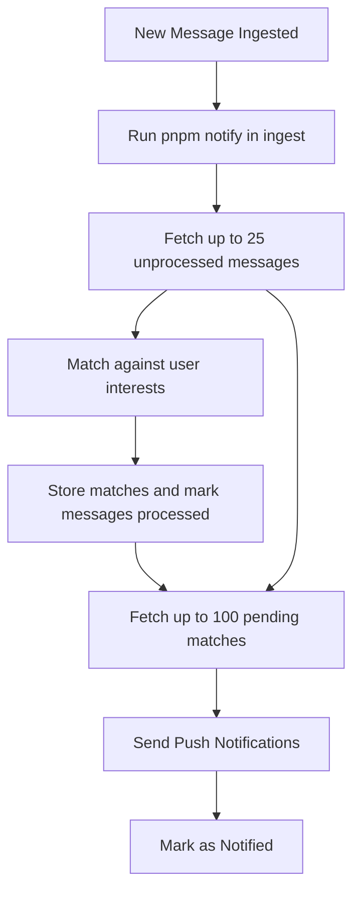

# Notifications System

This directory matches infrastructure messages to users' areas of interest and
sends push notifications through Firebase Cloud Messaging (FCM).

## User Flow

1. The user signs in and defines interest circles.
2. The user enables notifications for the current device through the subscription
   prompt or settings. Browser permission is required.
3. The web client obtains an FCM token and saves the device subscription through
   the authenticated subscription API.
4. Scheduled notification processing sends matching messages to subscribed devices,
   respecting source/category preferences and experimental-source opt-in.

## Notification Trigger Flow


```mermaid
flowchart TD
    A[New Message Ingested] --> B[Run pnpm notify in ingest]
    B --> C[Fetch up to 25 unprocessed messages]
    C --> D[Match against user interests]
    D --> E[Store matches and mark messages processed]
    E --> H[Fetch up to 100 pending matches]
    C --> H
    H --> I[Send Push Notifications]
    I --> J[Mark as Notified]
```

Each run reads only the fields needed for matching. Expired messages in the
oldest batch are marked processed so later runs can advance. Pending matches
are sent in bounded batches even when there are no new messages. A backlog
therefore drains over successive scheduled runs.

## Components

Paths below are relative to the repository root.

- `web/lib/notification-service.ts`: browser permission, FCM token registration,
  subscription management, and sign-out cleanup.
- `web/lib/hooks/useSubscribeCurrentDevice.ts`: subscription actions and status
  refresh for the notification UI.
- `web/scripts/firebase-messaging-sw.template.js`: background notification display
  and click handling; generates `web/public/firebase-messaging-sw.js`.
- `ingest/notifications/match-and-notify.ts`: orchestrates matching and delivery.
- `ingest/notifications/notification-sender.ts`: builds payloads, sends to devices,
  records delivery results, and removes stale subscriptions.
- `web/app/api/notifications/subscription/route.ts`: authenticated GET, POST, and
  DELETE operations for device subscriptions.

### Source Logos

The normal delivery flow preserves the stored message's `source`. The sender
uses `${APP_URL}/sources/{source-id}.png` as `data.senderIcon`; missing, empty,
or non-string sources fall back to `${APP_URL}/icon-192x192.png`. Source assets
live in `web/public/sources/`.

The service worker prioritizes `senderIcon` for the notification's main icon.
The payload keeps the OboApp app icon and badge separately. This fallback handles
missing source identifiers; it does not check whether an image URL loads.

## Database Collections

All database access goes through `@oboapp/db`.

- `notificationSubscriptions`: user/device FCM tokens, endpoint, timestamps, and
  optional device information. See
  [the subscription schema](../../shared/src/schema/notification-subscription.schema.ts).
- `notificationMatches`: message/user/interest matches, notification status,
  per-device delivery results, and message snapshots used by notification history.
  See [notification types](../lib/types.ts) and
  [the collection adapter](../../db/src/collections/notification-matches.ts).

## Notifications report

The public notifications report summarizes successful FCM sends, push clicks,
and opens from notification history using a weekly GCS snapshot. Failed sends,
missing subscriptions, and unknown legacy outcomes are counted separately.
See [metric definitions and deployment](../../docs/features/notifications-report.md).

## Running the Notification Script

Run from `ingest/`, after ingestion:

```bash
pnpm ingest
pnpm notify
```

## Setup Requirements

Configure the web client's `NEXT_PUBLIC_FIREBASE_*` values, including
`NEXT_PUBLIC_FIREBASE_VAPID_KEY`, in `web/.env.local` for local development or in
its deployment environment. Obtain the VAPID key from Firebase Console under
Project Settings → Cloud Messaging → Web Push certificates.

Configure database access and Firebase Admin credentials for the ingest process.
Set `APP_URL` to the public web origin in `ingest/.env.local` or the ingest
runtime environment. It is required when `NODE_ENV=production`; outside production,
the sender falls back to `http://localhost:3000`.

### Service Worker Generation

Edit `web/scripts/firebase-messaging-sw.template.js` for behavior changes.
Do not edit the generated `web/public/firebase-messaging-sw.js` directly.

The `predev`, `prebuild`, and `prestart` scripts run
`web/scripts/generate-firebase-messaging-sw.mjs`, which reads the web environment
and injects Firebase configuration. To regenerate manually from `web/`:

```bash
node scripts/generate-firebase-messaging-sw.mjs
```

The generator requires `NEXT_PUBLIC_FIREBASE_API_KEY`,
`NEXT_PUBLIC_FIREBASE_AUTH_DOMAIN`, `NEXT_PUBLIC_FIREBASE_PROJECT_ID`,
`NEXT_PUBLIC_FIREBASE_STORAGE_BUCKET`, `NEXT_PUBLIC_FIREBASE_MESSAGING_SENDER_ID`,
and `NEXT_PUBLIC_FIREBASE_APP_ID`. Missing configuration produces a worker with
background messaging disabled and a warning.

## Notification Permission States

- **default**: permission has not been granted or denied; enabling notifications
  requests browser permission.
- **granted**: the device can register an FCM subscription.
- **denied**: the user must change browser settings before subscribing.

## Matching and Deduplication

Messages are matched to interest circles using geographic intersection, with
special handling for city-wide messages and locality boundaries. Source/category
filters and experimental-source opt-in are applied before delivery.

Multiple interests can match one message. Within each pending batch, delivery
is deduplicated by user/message, selecting the closest match. Each subscribed
device is then sent the notification once. Related matches are marked notified.

## Error Handling

- Failed sends are logged and recorded in per-device delivery results.
- FCM `messaging/registration-token-not-registered` and
  `messaging/invalid-registration-token` errors automatically remove the stale
  subscription.
- Processed pending matches are marked notified even when delivery fails, avoiding
  repeated delivery attempts. FCM acceptance does not prove display on a device.

## Future Enhancements

- User preferences for notification frequency.
- Digest notifications combining multiple messages.
