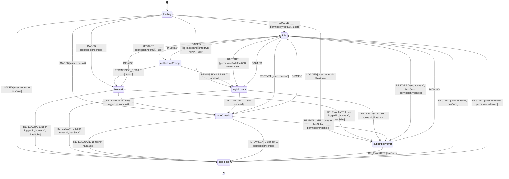

# useOnboardingFlow Hook

State machine hook for managing the user onboarding and engagement flow.

## Overview

This hook centralizes the onboarding UX logic for all users, guiding them through:

1. Notification permission prompt (unauthenticated users)
2. Login
3. Zone creation
4. Push notification subscription

**Unauthenticated Users:** Land in `idle` state (showing only AddInterestButton).
This keeps the UI clean and unobtrusive. The onboarding flow starts when the user
clicks the button, which dispatches `RESTART` and shows the `NotificationPrompt`.

**Authenticated Users:** Land in the appropriate state based on their progress
(`zoneCreation`, `subscribePrompt`, or `complete`).

## State Machine Diagram



## States

| State                | Description                                                     | UI Shown                   |
| -------------------- | --------------------------------------------------------------- | -------------------------- |
| `loading`            | Initial state while checking subscriptions                      | None (loading indicator)   |
| `notificationPrompt` | Ask user about notifications before login                       | NotificationPrompt         |
| `blocked`            | Notifications blocked at browser/OS level                       | BlockedNotificationsPrompt |
| `loginPrompt`        | Ask user to log in                                              | LoginPrompt                |
| `zoneCreation`       | User logged in but has no zones                                 | AddInterestsPrompt         |
| `subscribePrompt`    | User has zones but no push subscriptions                        | SubscribePrompt            |
| `complete`           | Fully onboarded                                                 | AddInterestButton          |
| `idle`               | Initial state for unauthenticated users, or user dismissed flow | AddInterestButton          |

## Actions

| Action              | Description               | Valid From           |
| ------------------- | ------------------------- | -------------------- |
| `LOADED`            | Initial load with context | `loading`            |
| `PERMISSION_RESULT` | Browser permission result | `notificationPrompt` |

| `DISMISS` | User dismissed current prompt | Most states |
| `RESTART` | Re-enter flow from idle | `idle` |
| `RE_EVALUATE` | External state changed (user, zones, subs) | All except `idle` |

## Usage

```tsx
const { state, handlePermissionResult, handleDismiss, handleRestart } =
  useOnboardingFlow({
    user,
    interests,
    subscriptionsLoaded,
    hasSubscriptions,
  });

// Render based on state
switch (state) {
  case "loading":
    return null; // Or loading indicator
  case "notificationPrompt":
    return (
      <NotificationPrompt
        onPermissionResult={handlePermissionResult}
        onDismiss={handleDismiss}
      />
    );
  case "blocked":
    return <BlockedNotificationsPrompt onDismiss={handleDismiss} />;
  case "loginPrompt":
    return <LoginPrompt onDismiss={handleDismiss} />;
  case "zoneCreation":
    return (
      <AddInterestsPrompt
        onAddInterests={startTargetMode}
        onDismiss={handleDismiss}
      />
    );
  case "subscribePrompt":
    return <SubscribePrompt onClose={handleDismiss} />;
  case "idle":
  case "complete":
    return (
      <AddInterestButton
        onClick={state === "idle" ? handleRestart : startTargetMode}
      />
    );
}
```
